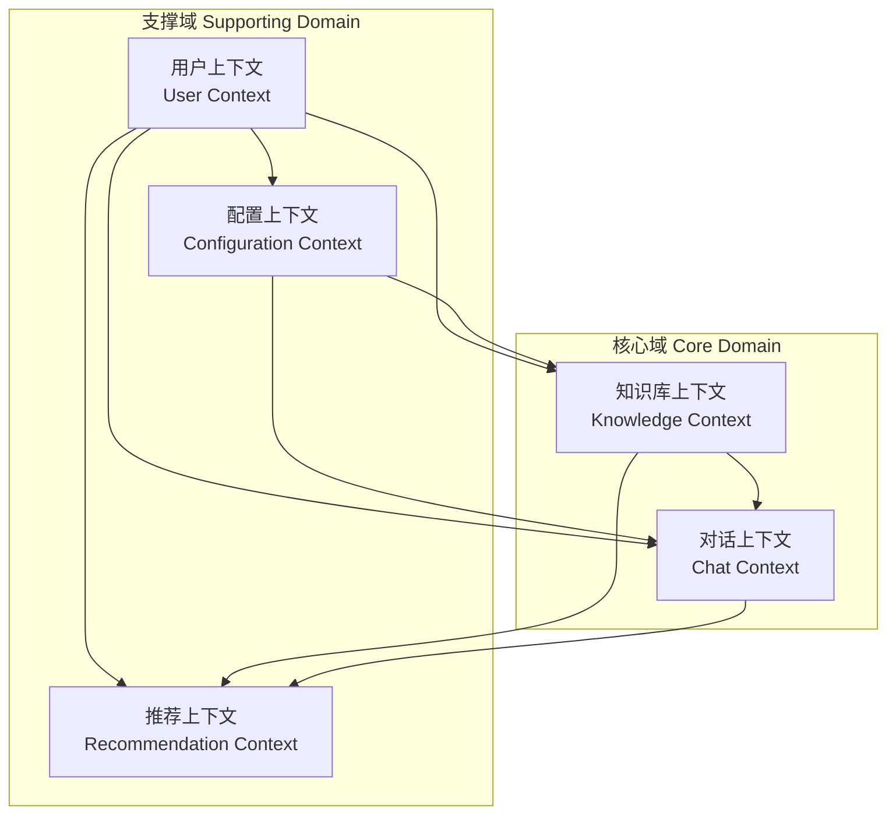
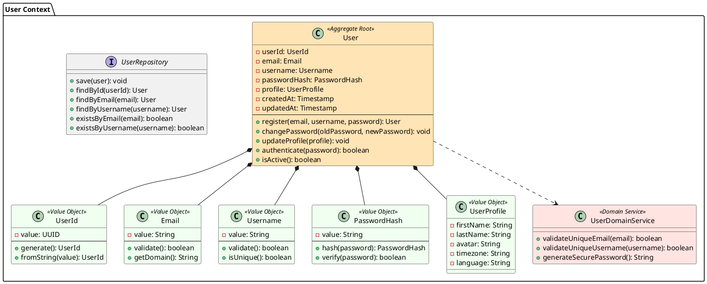
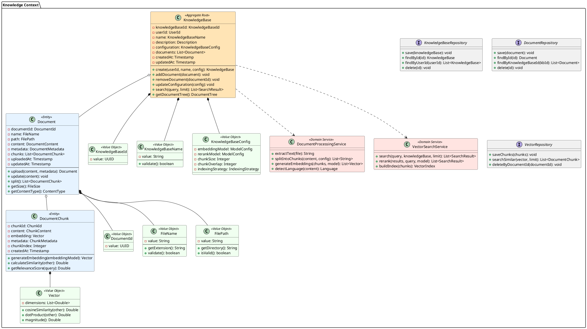
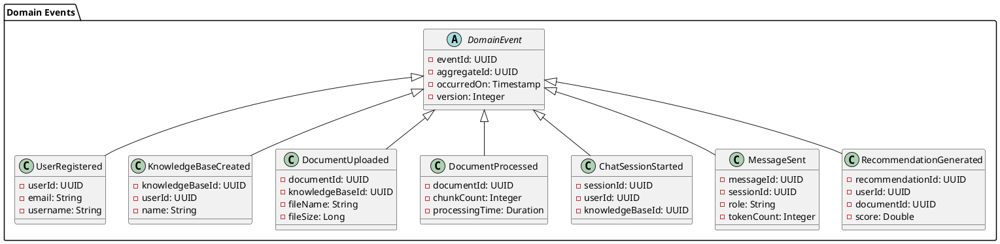
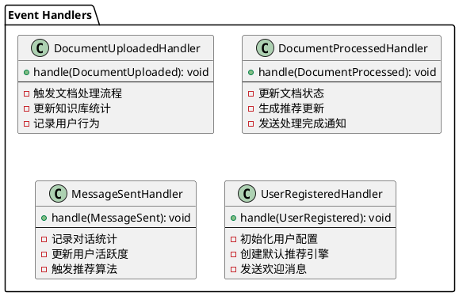

# DDD领域模型设计文档

## 1. 战略设计 - 限界上下文

### 1.1 上下文映射图

### 1.2 限界上下文定义

* **用户上下文 (User Context)**: 负责用户身份认证、授权和基本信息管理

* **知识库上下文 (Knowledge Context)**: 核心域，负责知识库创建、文档管理、向量化和检索

* **对话上下文 (Chat Context)**: 核心域，负责LLM对话、RAG增强和对话历史管理

* **推荐上下文 (Recommendation Context)**: 支撑域，负责智能推荐算法和学习目标管理

* **配置上下文 (Configuration Context)**: 支撑域，负责系统配置和模型参数管理

## 2. 战术设计 - 领域模型

### 2.1 用户上下文领域模型

### 2.2 知识库上下文领域模型

### 2.3 对话上下文领域模型

```plantuml
@startuml ChatContext
!define AGGREGATE_ROOT_COLOR #FFE4B5
!define ENTITY_COLOR #E6F3FF
!define VALUE_OBJECT_COLOR #F0FFF0
!define DOMAIN_SERVICE_COLOR #FFE4E1

package "Chat Context" {
    class ChatSession <<Aggregate Root>> AGGREGATE_ROOT_COLOR {
        - sessionId: SessionId
        - userId: UserId
        - title: SessionTitle
        - knowledgeBaseId: KnowledgeBaseId
        - modelConfig: ModelConfiguration
        - messages: List<Message>
        - status: SessionStatus
        - createdAt: Timestamp
        - updatedAt: Timestamp
        --
        + create(userId, title, modelConfig): ChatSession
        + addMessage(message): void
        + setKnowledgeBase(knowledgeBaseId): void
        + updateTitle(title): void
        + close(): void
        + exportToMarkdown(): String
    }
    
    class Message <<Entity>> ENTITY_COLOR {
        - messageId: MessageId
        - role: MessageRole
        - content: MessageContent
        - metadata: MessageMetadata
        - timestamp: Timestamp
        --
        + createUserMessage(content): Message
        + createAssistantMessage(content, metadata): Message
        + createSystemMessage(content): Message
        + getTokenCount(): Integer
    }
    
    class PromptTemplate <<Aggregate Root>> AGGREGATE_ROOT_COLOR {
        - templateId: TemplateId
        - userId: UserId
        - name: TemplateName
        - content: TemplateContent
        - variables: List<TemplateVariable>
        - category: TemplateCategory
        - createdAt: Timestamp
        - updatedAt: Timestamp
        --
        + create(userId, name, content): PromptTemplate
        + addVariable(variable): void
        + render(values): String
        + validate(): boolean
        + clone(): PromptTemplate
    }
    
    class SessionId <<Value Object>> VALUE_OBJECT_COLOR {
        - value: UUID
    }
    
    class SessionTitle <<Value Object>> VALUE_OBJECT_COLOR {
        - value: String
        --
        + validate(): boolean
        + generateFromFirstMessage(message): SessionTitle
    }
    
    class ModelConfiguration <<Value Object>> VALUE_OBJECT_COLOR {
        - modelName: String
        - temperature: Double
        - maxTokens: Integer
        - topP: Double
        - frequencyPenalty: Double
        - presencePenalty: Double
        --
        + validate(): boolean
        + getDefaultConfig(): ModelConfiguration
    }
    
    class MessageRole <<Value Object>> VALUE_OBJECT_COLOR {
        - value: String
        --
        + USER: MessageRole
        + ASSISTANT: MessageRole
        + SYSTEM: MessageRole
    }
    
    class MessageContent <<Value Object>> VALUE_OBJECT_COLOR {
        - text: String
        - attachments: List<Attachment>
        --
        + getPlainText(): String
        + hasAttachments(): boolean
        + getTokenCount(): Integer
    }
    
    class RAGService <<Domain Service>> DOMAIN_SERVICE_COLOR {
        + enhancePrompt(query, knowledgeBase): String
        + retrieveRelevantChunks(query, knowledgeBase): List<DocumentChunk>
        + generateContextualPrompt(query, chunks): String
        + calculateRelevanceScore(query, chunk): Double
    }
    
    class LLMService <<Domain Service>> DOMAIN_SERVICE_COLOR {
        + generateResponse(messages, config): String
        + streamResponse(messages, config): Stream<String>
        + validateModel(modelName): boolean
        + estimateTokens(content): Integer
    }
    
    interface ChatSessionRepository {
        + save(session): void
        + findById(id): ChatSession
        + findByUserId(userId): List<ChatSession>
        + findRecentSessions(userId, limit): List<ChatSession>
        + delete(id): void
    }
    
    interface PromptTemplateRepository {
        + save(template): void
        + findById(id): PromptTemplate
        + findByUserId(userId): List<PromptTemplate>
        + findByCategory(category): List<PromptTemplate>
        + delete(id): void
    }
    
    ChatSession *-- SessionId
    ChatSession *-- SessionTitle
    ChatSession *-- ModelConfiguration
    ChatSession o-- Message
    Message *-- MessageRole
    Message *-- MessageContent
    PromptTemplate *-- TemplateName
    ChatSession ..> RAGService
    ChatSession ..> LLMService
}
@enduml
```

### 2.4 推荐上下文领域模型

```plantuml
@startuml RecommendationContext
!define AGGREGATE_ROOT_COLOR #FFE4B5
!define ENTITY_COLOR #E6F3FF
!define VALUE_OBJECT_COLOR #F0FFF0
!define DOMAIN_SERVICE_COLOR #FFE4E1

package "Recommendation Context" {
    class RecommendationEngine <<Aggregate Root>> AGGREGATE_ROOT_COLOR {
        - engineId: EngineId
        - userId: UserId
        - preferences: UserPreferences
        - learningGoals: List<LearningGoal>
        - behaviorHistory: List<UserBehavior>
        - lastUpdated: Timestamp
        --
        + generateRecommendations(limit): List<Recommendation>
        + updatePreferences(preferences): void
        + addLearningGoal(goal): void
        + recordBehavior(behavior): void
        + calculateMemoryCurve(document): MemoryCurveScore
    }
    
    class Recommendation <<Entity>> ENTITY_COLOR {
        - recommendationId: RecommendationId
        - documentId: DocumentId
        - score: RecommendationScore
        - reason: RecommendationReason
        - type: RecommendationType
        - generatedAt: Timestamp
        - expiresAt: Timestamp
        --
        + isValid(): boolean
        + getDisplayText(): String
        + markAsViewed(): void
        + markAsCompleted(): void
    }
    
    class LearningGoal <<Entity>> ENTITY_COLOR {
        - goalId: GoalId
        - title: GoalTitle
        - description: GoalDescription
        - targetDocuments: List<DocumentId>
        - progress: GoalProgress
        - deadline: Timestamp
        - status: GoalStatus
        --
        + create(title, description, deadline): LearningGoal
        + updateProgress(progress): void
        + complete(): void
        + isOverdue(): boolean
    }
    
    class UserBehavior <<Value Object>> VALUE_OBJECT_COLOR {
        - behaviorType: BehaviorType
        - documentId: DocumentId
        - duration: Duration
        - timestamp: Timestamp
        - metadata: BehaviorMetadata
        --
        + VIEW: BehaviorType
        + UPLOAD: BehaviorType
        + SEARCH: BehaviorType
        + CHAT: BehaviorType
    }
    
    class MemoryCurveScore <<Value Object>> VALUE_OBJECT_COLOR {
        - score: Double
        - lastReviewDate: Timestamp
        - reviewCount: Integer
        - difficulty: Double
        --
        + calculateNextReviewDate(): Timestamp
        + updateAfterReview(performance): MemoryCurveScore
        + getRetentionProbability(): Double
    }
    
    class RecommendationScore <<Value Object>> VALUE_OBJECT_COLOR {
        - value: Double
        - factors: Map<String, Double>
        --
        + combine(other): RecommendationScore
        + normalize(): RecommendationScore
        + getTopFactors(): List<String>
    }
    
    class MemoryCurveService <<Domain Service>> DOMAIN_SERVICE_COLOR {
        + calculateForgettingCurve(behavior): Double
        + getOptimalReviewTime(document, history): Timestamp
        + adjustDifficultyLevel(document, performance): Double
        + predictRetention(document, timespan): Double
    }
    
    class RecommendationAlgorithm <<Domain Service>> DOMAIN_SERVICE_COLOR {
        + generateContentBasedRecommendations(user): List<Recommendation>
        + generateCollaborativeRecommendations(user): List<Recommendation>
        + generateMemoryCurveRecommendations(user): List<Recommendation>
        + combineRecommendations(lists): List<Recommendation>
    }
    
    interface RecommendationRepository {
        + save(recommendation): void
        + findByUserId(userId): List<Recommendation>
        + findActiveRecommendations(userId): List<Recommendation>
        + deleteExpired(): void
    }
    
    interface UserBehaviorRepository {
        + save(behavior): void
        + findByUserId(userId): List<UserBehavior>
        + findRecentBehaviors(userId, days): List<UserBehavior>
        + getStatistics(userId): BehaviorStatistics
    }
    
    RecommendationEngine *-- UserPreferences
    RecommendationEngine o-- LearningGoal
    RecommendationEngine o-- UserBehavior
    RecommendationEngine o-- Recommendation
    Recommendation *-- RecommendationScore
    UserBehavior *-- BehaviorType
    LearningGoal *-- GoalProgress
    RecommendationEngine ..> MemoryCurveService
    RecommendationEngine ..> RecommendationAlgorithm
}
@enduml
```

## 3. 领域事件设计

### 3.1 事件定义

### 3.2 事件处理器

## 4. 聚合设计原则

### 4.1 聚合边界

* **User聚合**: 以用户为根，包含用户基本信息和认证相关数据

* **KnowledgeBase聚合**: 以知识库为根，包含文档和文档块，保证知识库内容的一致性

* **ChatSession聚合**: 以对话会话为根，包含消息列表，保证对话的完整性

* **RecommendationEngine聚合**: 以推荐引擎为根，包含用户偏好和学习目标

* **PromptTemplate聚合**: 以提示词模板为根，独立管理模板生命周期

### 4.2 聚合间通信

* 聚合间通过领域事件进行异步通信

* 避免聚合间的直接引用

* 使用最终一致性保证数据一致性

* 通过应用服务协调跨聚合的业务流程

### 4.3 事务边界

* 每个聚合作为一个事务边界

* 跨聚合操作使用Saga模式

* 通过事件溯源记录状态变更

* 使用补偿操作处理失败场景

