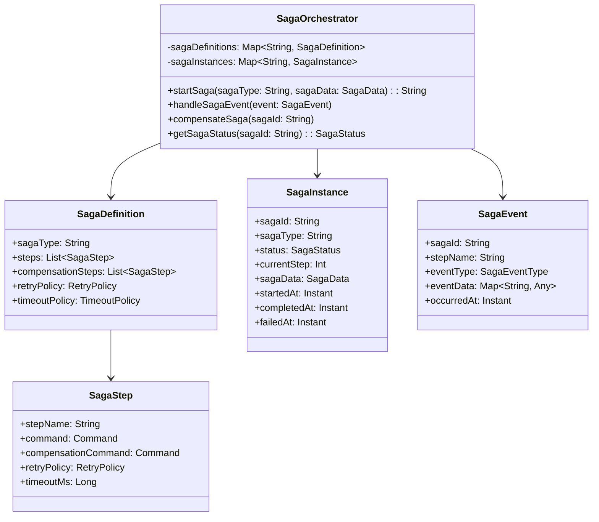
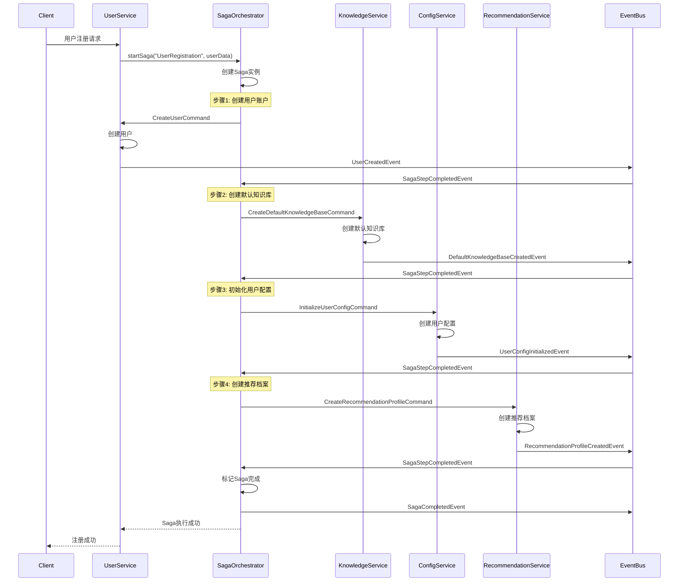
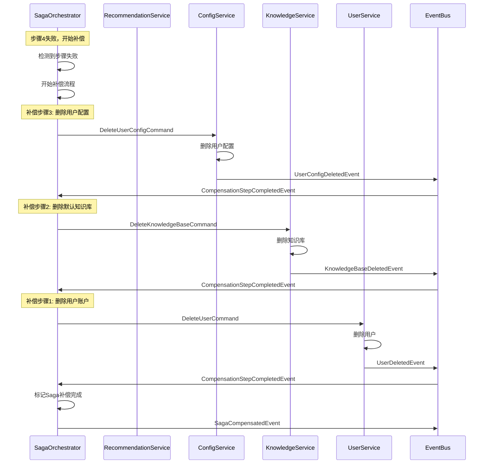
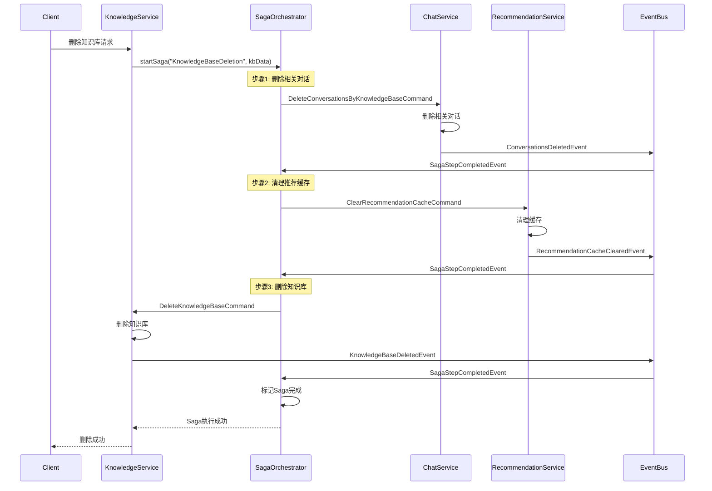
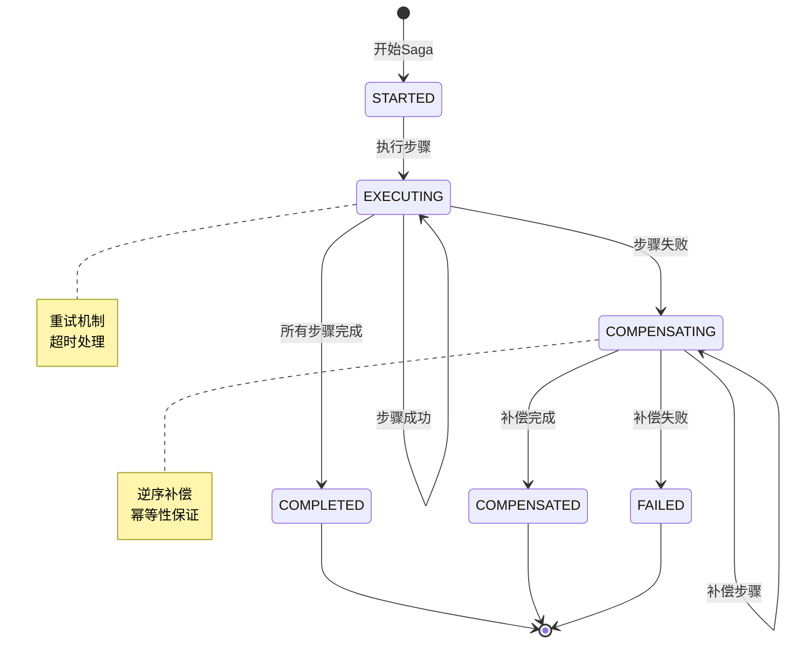
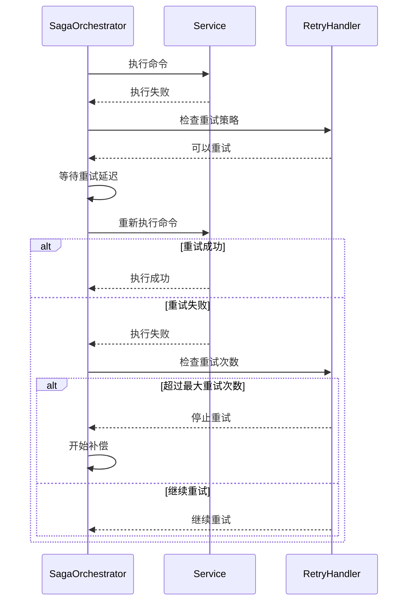
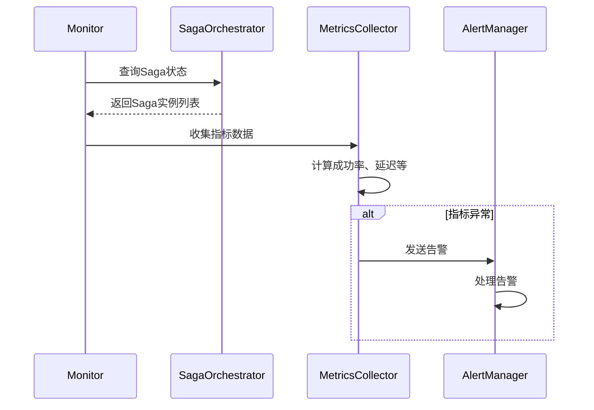

# Saga事务协调流程文档

## 1. Saga事务概述

Saga事务模式是本系统处理分布式长事务的核心机制，通过将长事务分解为一系列本地事务，并提供补偿机制来确保最终一致性。

## 2. Saga核心组件

### 2.1 核心类图



### 2.2 组件职责

- **SagaOrchestrator**: Saga协调器，管理Saga实例的生命周期
- **SagaDefinition**: Saga定义，描述Saga的步骤和补偿逻辑
- **SagaInstance**: Saga实例，表示正在执行的Saga事务
- **SagaStep**: Saga步骤，定义单个事务步骤和补偿操作
- **SagaEvent**: Saga事件，表示Saga执行过程中的状态变化

## 3. Saga事务流程

### 3.1 用户注册Saga流程



### 3.2 Saga补偿流程



### 3.3 知识库删除Saga流程



## 4. Saga状态管理

### 4.1 Saga状态转换图



### 4.2 状态说明

- **STARTED**: Saga已启动，准备执行第一个步骤
- **EXECUTING**: Saga正在执行步骤
- **COMPLETED**: Saga所有步骤执行成功
- **COMPENSATING**: Saga正在执行补偿操作
- **COMPENSATED**: Saga补偿操作完成
- **FAILED**: Saga执行失败且无法补偿

## 5. 重试和超时策略

### 5.1 重试策略配置

```kotlin
data class RetryPolicy(
    val maxRetryAttempts: Int = 3,
    val retryDelay: Long = 1000, // 毫秒
    val maxRetryDelay: Long = 30000, // 最大重试延迟
    val backoffMultiplier: Double = 2.0, // 退避倍数
    val retryableExceptions: List<Class<out Exception>> = listOf(
        TransientException::class.java,
        TimeoutException::class.java
    )
)
```

### 5.2 超时策略配置

```kotlin
data class TimeoutPolicy(
    val stepTimeoutMs: Long = 30000, // 单步超时
    val sagaTimeoutMs: Long = 300000, // Saga总超时
    val compensationTimeoutMs: Long = 60000 // 补偿超时
)
```

### 5.3 重试流程



## 6. Saga定义示例

### 6.1 用户注册Saga定义

```kotlin
val userRegistrationSaga = SagaDefinition(
    sagaType = "UserRegistration",
    steps = listOf(
        SagaStep(
            stepName = "CreateUser",
            command = CreateUserCommand::class,
            compensationCommand = DeleteUserCommand::class,
            retryPolicy = RetryPolicy(maxRetryAttempts = 3),
            timeoutMs = 10000
        ),
        SagaStep(
            stepName = "CreateDefaultKnowledgeBase",
            command = CreateDefaultKnowledgeBaseCommand::class,
            compensationCommand = DeleteKnowledgeBaseCommand::class,
            retryPolicy = RetryPolicy(maxRetryAttempts = 2),
            timeoutMs = 15000
        ),
        SagaStep(
            stepName = "InitializeUserConfig",
            command = InitializeUserConfigCommand::class,
            compensationCommand = DeleteUserConfigCommand::class,
            retryPolicy = RetryPolicy(maxRetryAttempts = 3),
            timeoutMs = 5000
        ),
        SagaStep(
            stepName = "CreateRecommendationProfile",
            command = CreateRecommendationProfileCommand::class,
            compensationCommand = DeleteRecommendationProfileCommand::class,
            retryPolicy = RetryPolicy(maxRetryAttempts = 2),
            timeoutMs = 8000
        )
    ),
    retryPolicy = RetryPolicy(maxRetryAttempts = 1),
    timeoutPolicy = TimeoutPolicy(sagaTimeoutMs = 60000)
)
```

## 7. 监控和运维

### 7.1 关键指标

- **Saga成功率**: 成功完成的Saga比例
- **Saga执行时间**: 平均执行时间和P99延迟
- **补偿频率**: 需要补偿的Saga比例
- **重试次数**: 平均重试次数和重试成功率
- **超时频率**: 超时的Saga步骤比例

### 7.2 告警策略

- **Saga失败率高**: 失败率超过5%时告警
- **执行时间过长**: 执行时间超过阈值时告警
- **补偿失败**: 补偿操作失败时立即告警
- **大量重试**: 重试次数异常增加时告警

### 7.3 Saga实例监控



## 8. 最佳实践

### 8.1 Saga设计原则

- **幂等性**: 所有Saga步骤和补偿操作必须是幂等的
- **可补偿性**: 每个步骤都必须有对应的补偿操作
- **原子性**: 每个Saga步骤应该是原子操作
- **隔离性**: Saga步骤之间应该尽量减少依赖

### 8.2 补偿设计原则

- **逆序补偿**: 按照执行步骤的逆序进行补偿
- **语义补偿**: 补偿操作应该在语义上撤销原操作的效果
- **补偿幂等**: 补偿操作可以安全地重复执行
- **补偿监控**: 补偿操作的执行状态需要被监控

### 8.3 性能优化建议

- **并行执行**: 无依赖的步骤可以并行执行
- **异步处理**: 使用异步消息处理Saga事件
- **状态持久化**: 及时持久化Saga状态避免数据丢失
- **资源清理**: 定期清理已完成的Saga实例数据

### 8.4 错误处理策略

- **分类处理**: 区分临时错误和永久错误
- **快速失败**: 对于明显的业务错误快速失败
- **优雅降级**: 在部分功能不可用时提供降级服务
- **人工干预**: 对于无法自动恢复的情况提供人工干预机制
