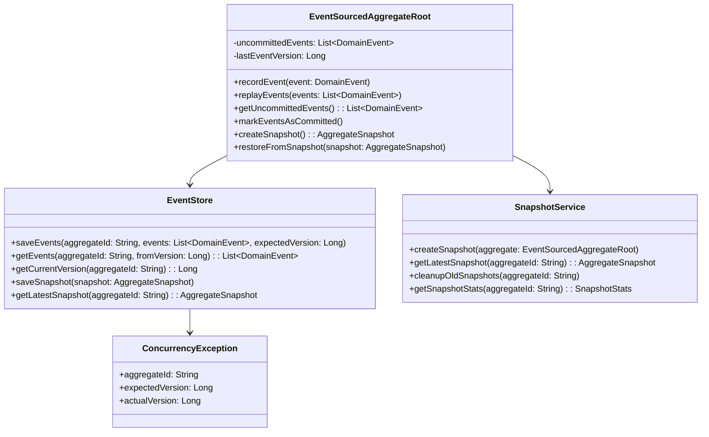
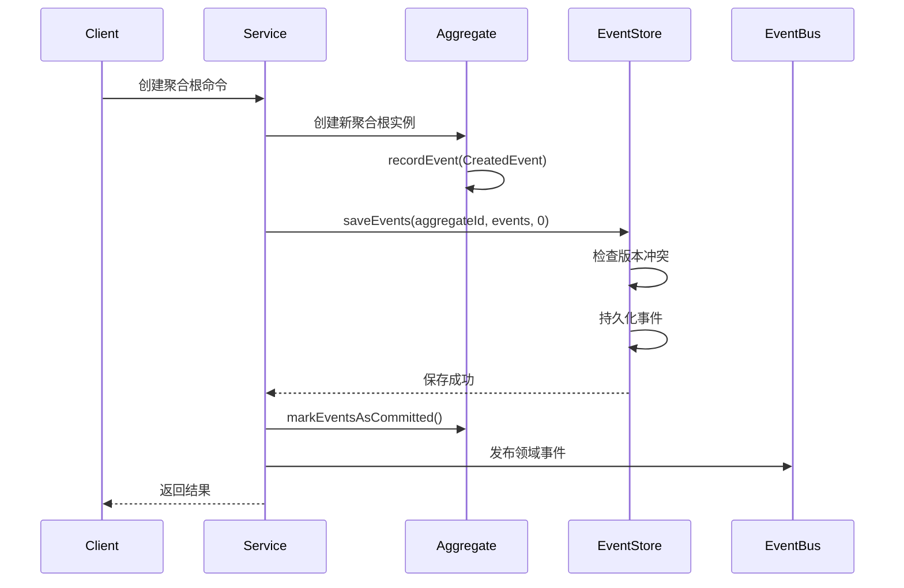
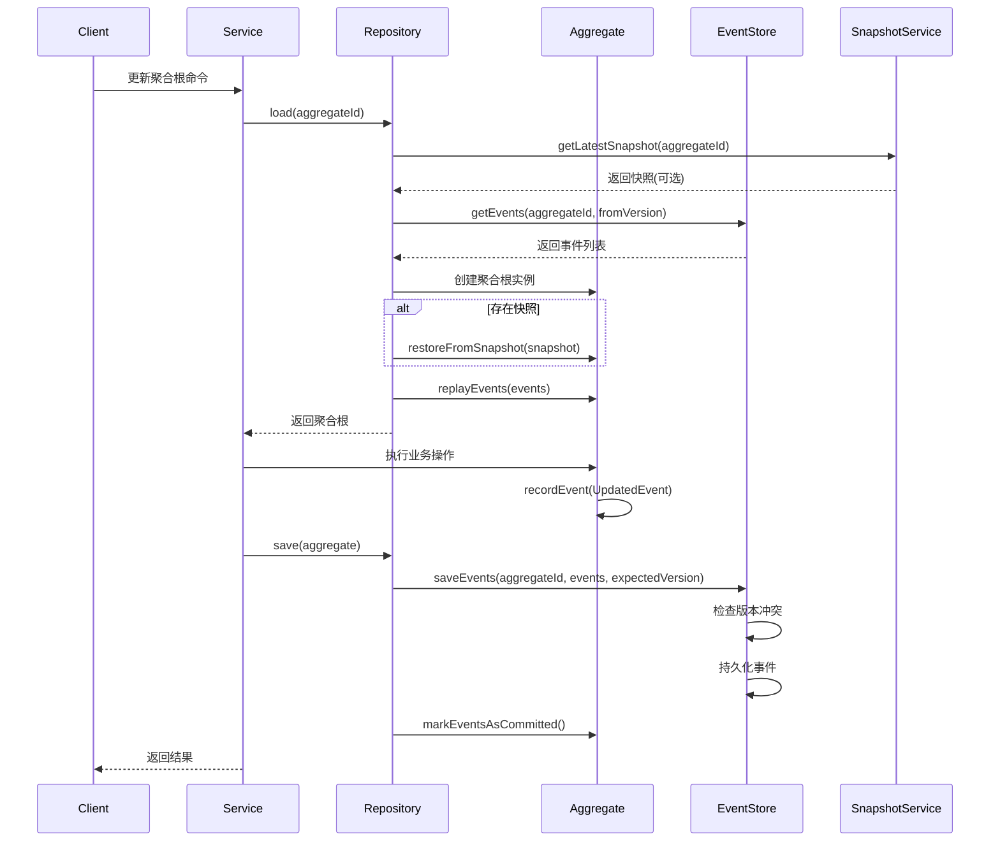
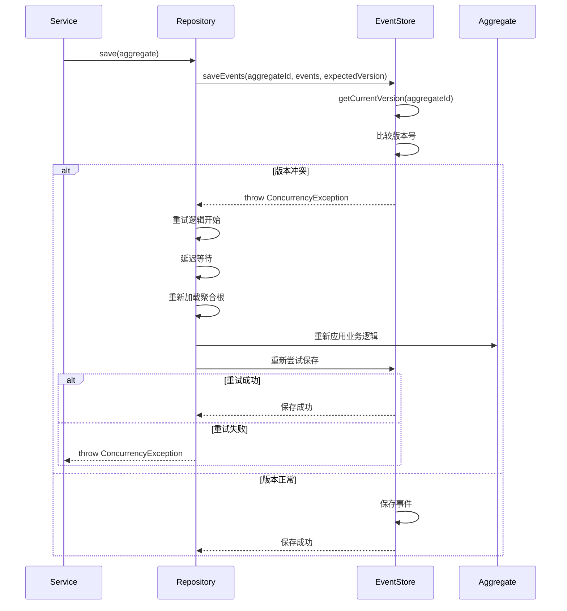
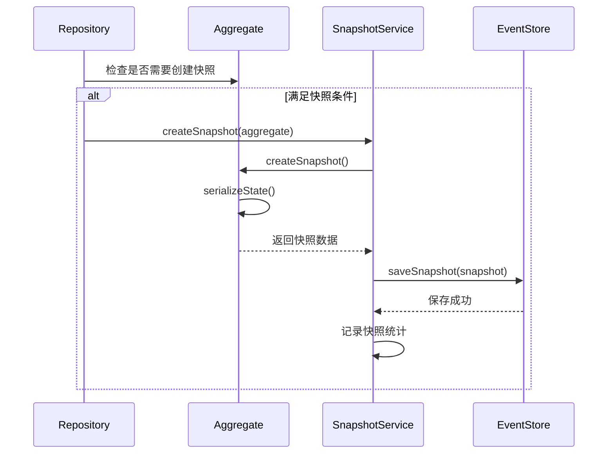
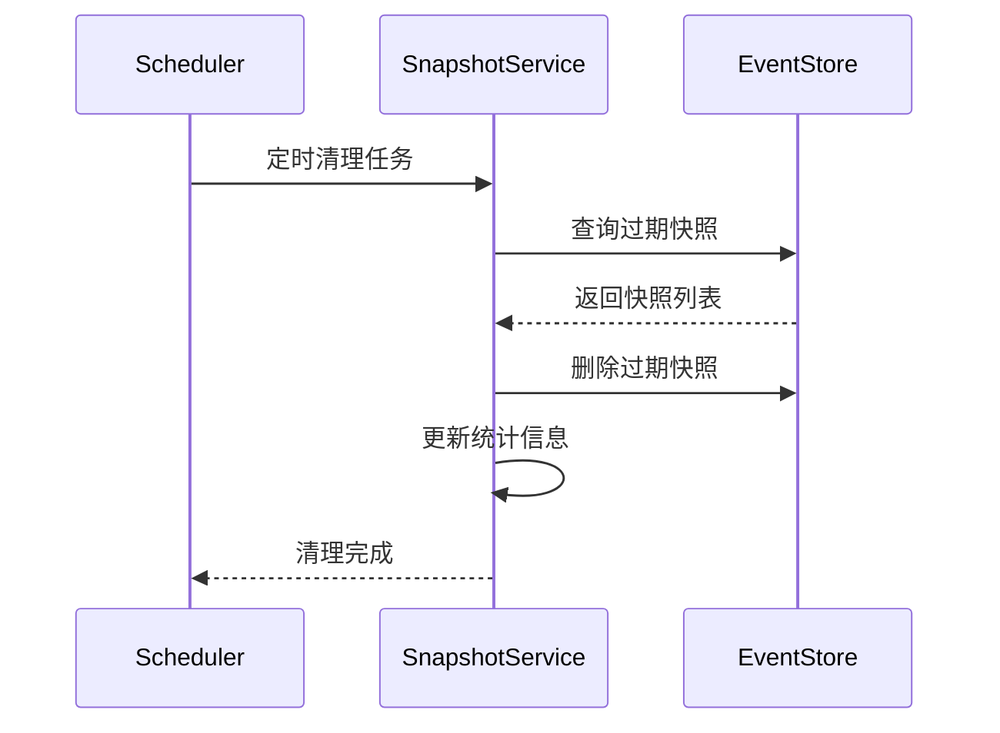
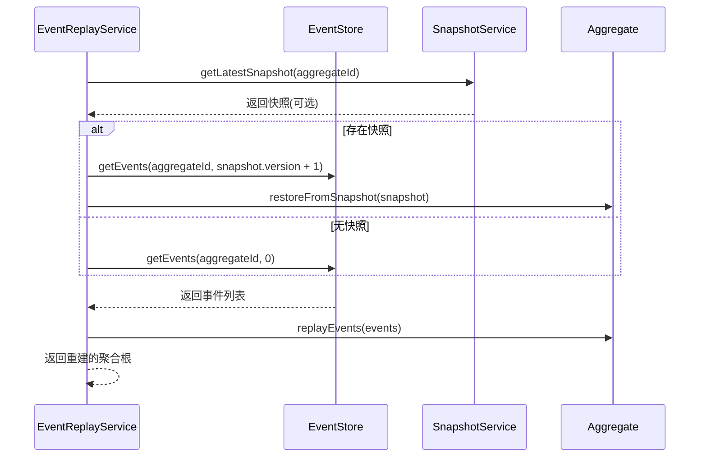

# 事件溯源架构流程文档

## 1. 事件溯源概述

事件溯源（Event Sourcing）是本系统的核心架构模式，通过记录所有状态变更事件来重建聚合根状态，确保数据的完整性和可追溯性。

## 2. 事件溯源核心组件

### 2.1 核心类图

### 2.2 组件职责

- **EventSourcedAggregateRoot**: 事件溯源聚合根基类，管理未提交事件和状态重建
- **EventStore**: 事件存储接口，负责事件持久化和检索
- **SnapshotService**: 快照服务，优化事件重放性能
- **ConcurrencyException**: 并发冲突异常，处理版本冲突

## 3. 事件溯源业务流程

### 3.1 聚合根创建流程

### 3.2 聚合根更新流程

### 3.3 并发冲突处理流程

## 4. 快照管理流程

### 4.1 快照创建流程

### 4.2 快照清理流程

## 5. 事件重放流程

### 5.1 完整重放流程

## 6. 性能优化策略

### 6.1 快照策略

- **事件数量阈值**: 每100个事件自动创建快照
- **时间阈值**: 24小时强制创建快照
- **快照保留**: 保留最近10个快照
- **清理策略**: 定期清理过期快照

### 6.2 事件存储优化

- **批量保存**: 支持批量保存多个事件
- **索引优化**: 在aggregateId和version字段上建立索引
- **分区策略**: 按聚合根类型或时间分区
- **压缩存储**: 对历史事件进行压缩存储

### 6.3 并发控制优化

- **乐观锁**: 使用版本号进行乐观锁控制
- **重试机制**: 指数退避重试策略
- **最大重试次数**: 限制重试次数防止无限重试
- **冲突监控**: 监控并发冲突频率和重试成功率

## 7. 监控和运维

### 7.1 关键指标

- **事件存储性能**: 事件保存和查询延迟
- **快照效率**: 快照创建频率和恢复时间
- **并发冲突率**: 版本冲突频率和重试成功率
- **聚合根大小**: 事件数量和快照大小

### 7.2 告警策略

- **高并发冲突**: 冲突率超过5%时告警
- **快照失败**: 快照创建失败时告警
- **事件存储异常**: 事件保存失败时告警
- **性能降级**: 事件重放时间超过阈值时告警

## 8. 最佳实践

### 8.1 事件设计原则

- **事件不可变**: 事件一旦创建不可修改
- **事件完整性**: 事件包含重建状态所需的所有信息
- **事件版本化**: 支持事件结构的演进
- **事件幂等性**: 重复应用事件不会产生副作用

### 8.2 聚合根设计原则

- **单一职责**: 每个聚合根负责一个业务概念
- **事务边界**: 聚合根是事务的边界
- **状态一致性**: 通过事件确保状态一致性
- **快照支持**: 实现快照创建和恢复方法

### 8.3 性能优化建议

- **合理使用快照**: 根据聚合根大小和访问频率调整快照策略
- **事件分页**: 大量事件时使用分页加载
- **异步处理**: 事件发布和处理使用异步模式
- **缓存策略**: 对频繁访问的聚合根使用缓存
