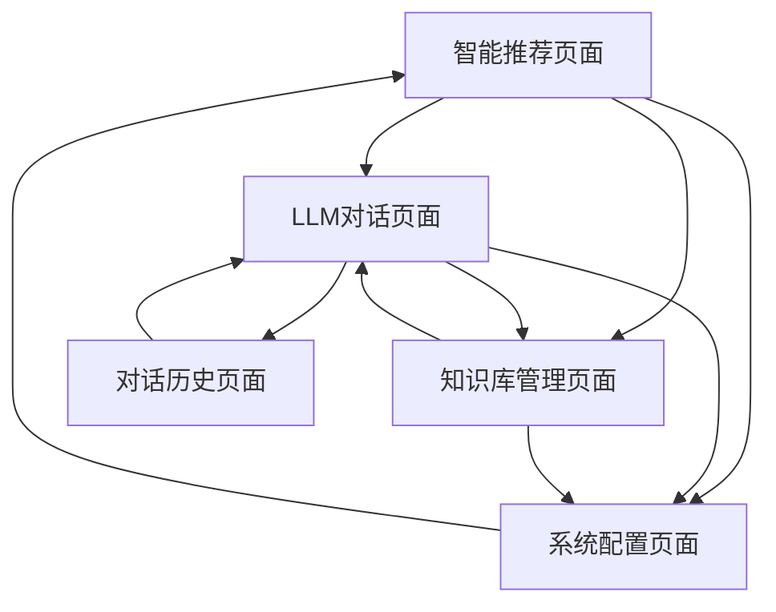

# 知识库管理系统产品需求文档

## 1. 产品概述

知识库管理系统是一个集成LLM对话和知识库管理功能的智能Web应用，旨在为个人用户提供高效的知识存储、检索和智能对话服务。

系统通过RAG技术增强LLM对话能力，结合智能推荐算法帮助用户更好地管理和利用个人知识库，提升学习和工作效率。

该产品将作为SaaS服务提供给个人用户，具备良好的扩展性和安全性。

## 2. 核心功能

### 2.1 用户角色

| 角色 | 注册方式 | 核心权限 |
|------|----------|----------|
| 普通用户 | 邮箱注册 | 可使用所有功能模块，管理个人知识库和对话记录 |

### 2.2 功能模块

本系统包含以下5个核心页面：

1. **智能推荐页面**：系统首页，智能推荐模块，基于记忆曲线的文章推荐，学习目标设置
2. **LLM对话页面**：对话界面，提示词管理，模型选择，RAG增强对话
3. **知识库管理页面**：知识库创建，文件上传管理，目录树浏览，搜索功能
4. **对话历史页面**：历史记录查看，对话详情展示，内容导出功能
5. **系统配置页面**：模型参数配置，MCP服务配置，用户信息管理

### 2.3 页面详情

| 页面名称 | 模块名称 | 功能描述 |
|----------|----------|----------|
| 智能推荐页面 | 推荐算法模块 | 基于记忆曲线和用户行为分析，智能推荐阅读文章和复习内容 |
| 智能推荐页面 | 目标管理模块 | 设置学习目标，跟踪学习进度，提供个性化学习建议 |
| 智能推荐页面 | 统计面板模块 | 展示知识库统计信息、对话次数、学习时长等数据 |
| LLM对话页面 | 对话界面模块 | 实时对话交互，支持文本输入，流式响应显示 |
| LLM对话页面 | 提示词管理模块 | 创建、编辑、保存和复用自定义提示词模板 |
| LLM对话页面 | 模型选择模块 | 选择对话模型，调整模型参数，配置RAG知识库 |
| LLM对话页面 | 内容保存模块 | 将对话内容保存为Markdown文档并上传到指定知识库 |
| 知识库管理页面 | 知识库创建模块 | 创建新知识库，配置嵌入模型和重排序模型参数 |
| 知识库管理页面 | 文件管理模块 | 批量上传文件和文件夹，支持文件覆盖和删除操作 |
| 知识库管理页面 | 目录浏览模块 | 树形结构展示知识库目录，查看文件详情和内容 |
| 知识库管理页面 | 搜索功能模块 | 基于向量搜索的知识库内容检索，返回相关文档片段 |
| 对话历史页面 | 历史列表模块 | 分页展示对话历史，支持按时间、知识库等条件筛选 |
| 对话历史页面 | 详情查看模块 | 查看完整对话内容，包括时间、模型、知识库等信息 |
| 对话历史页面 | 导出功能模块 | 导出对话记录为多种格式，支持批量操作 |
| 系统配置页面 | 模型配置模块 | 配置对话模型、嵌入模型、重排序模型和分段模型参数 |
| 系统配置页面 | MCP配置模块 | 动态添加和管理MCP服务，配置服务参数 |
| 系统配置页面 | 用户管理模块 | 修改用户信息、密码，管理账户设置 |
| 系统配置页面 | 数据管理模块 | 全局数据导入导出，系统备份和恢复功能 |

## 3. 核心流程

### 用户主要操作流程

**知识库管理流程：**
用户登录后，在知识库管理页面创建新知识库，选择合适的嵌入模型和重排序模型。然后上传文档文件，系统自动进行文档分段和向量化处理。用户可以通过目录树浏览文件，使用搜索功能快速定位相关内容。

**LLM对话流程：**
用户在对话页面选择对话模型和知识库（可选），输入问题或使用预设提示词开始对话。系统基于RAG技术检索相关知识库内容增强回答质量。对话结束后，用户可选择将内容保存为文档并上传到知识库。

**智能推荐流程：**
系统根据用户的文件上传时间、修改记录和阅读行为，结合记忆曲线算法计算推荐权重。在首页展示个性化推荐内容，帮助用户及时复习和学习。

## 4. 用户界面设计

### 4.1 设计风格

- **主色调**：深蓝色(#1e40af)作为主色，浅蓝色(#3b82f6)作为辅助色
- **按钮样式**：圆角按钮设计，支持悬停和点击状态变化
- **字体**：Inter字体，标题使用18-24px，正文使用14-16px
- **布局风格**：卡片式布局，左侧导航栏，响应式设计
- **图标风格**：使用Lucide图标库，简洁现代的线性图标

### 4.2 页面设计概览

| 页面名称 | 模块名称 | UI元素 |
|----------|----------|--------|
| 智能推荐页面 | 推荐卡片区域 | 网格布局的推荐卡片，包含文章标题、摘要、推荐理由和操作按钮 |
| 智能推荐页面 | 统计面板 | 仪表盘样式的数据展示，使用图表组件显示学习进度 |
| LLM对话页面 | 对话区域 | 聊天气泡样式，支持Markdown渲染，流式文本显示 |
| LLM对话页面 | 输入区域 | 多行文本输入框，工具栏包含提示词选择和模型配置 |
| 知识库管理页面 | 文件树 | 可折叠的树形组件，支持拖拽上传和右键菜单操作 |
| 知识库管理页面 | 文件预览 | 分屏布局，左侧文件树，右侧内容预览区域 |
| 对话历史页面 | 历史列表 | 表格形式展示，支持分页和筛选功能 |
| 系统配置页面 | 配置表单 | 分组的表单布局，使用标签页组织不同配置类别 |

### 4.3 响应式设计

系统采用移动优先的响应式设计，支持桌面端、平板和手机端访问。在移动端优化触摸交互体验，调整布局和字体大小以适应小屏幕设备。