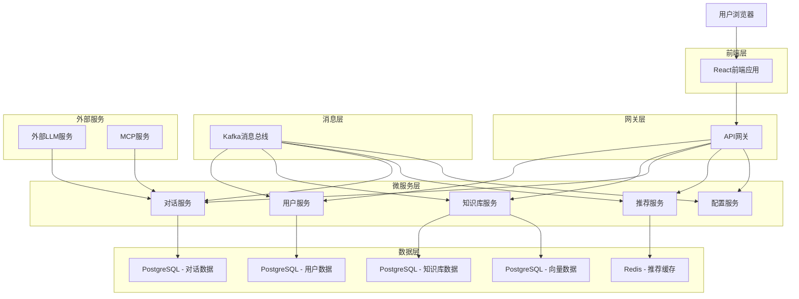
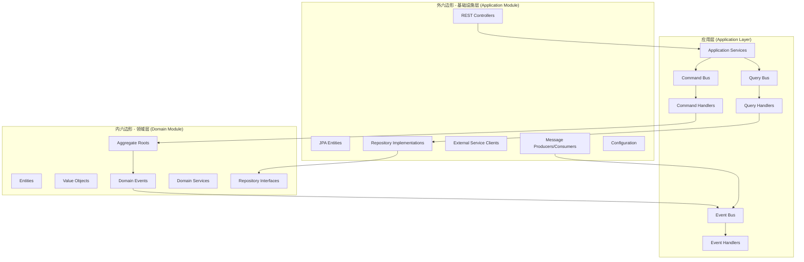
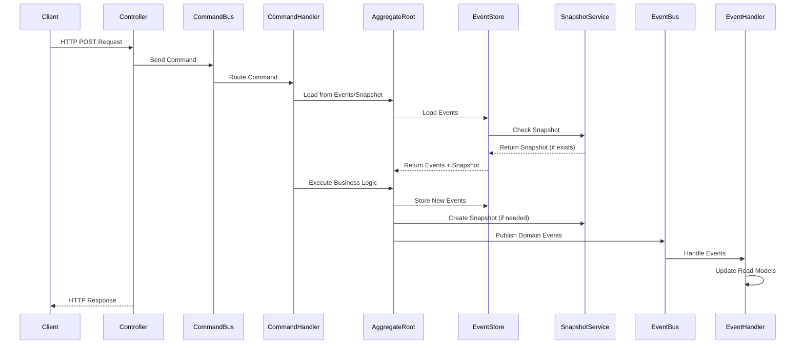
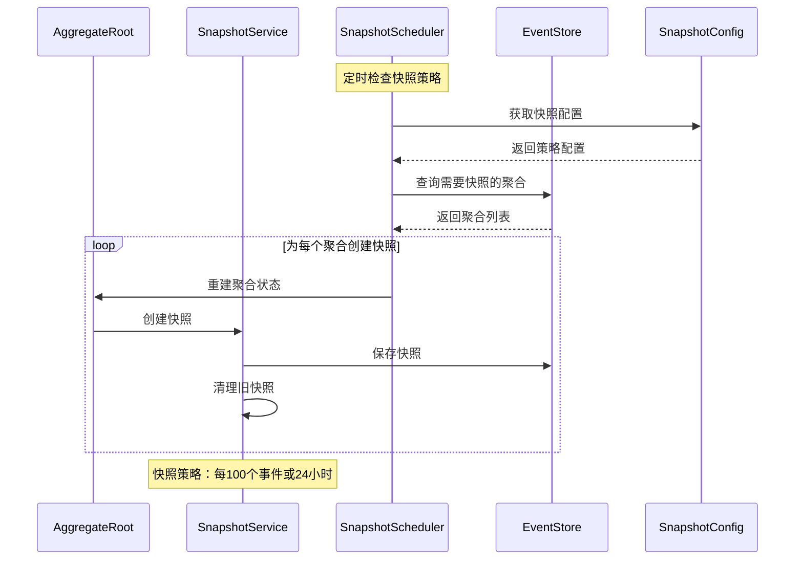
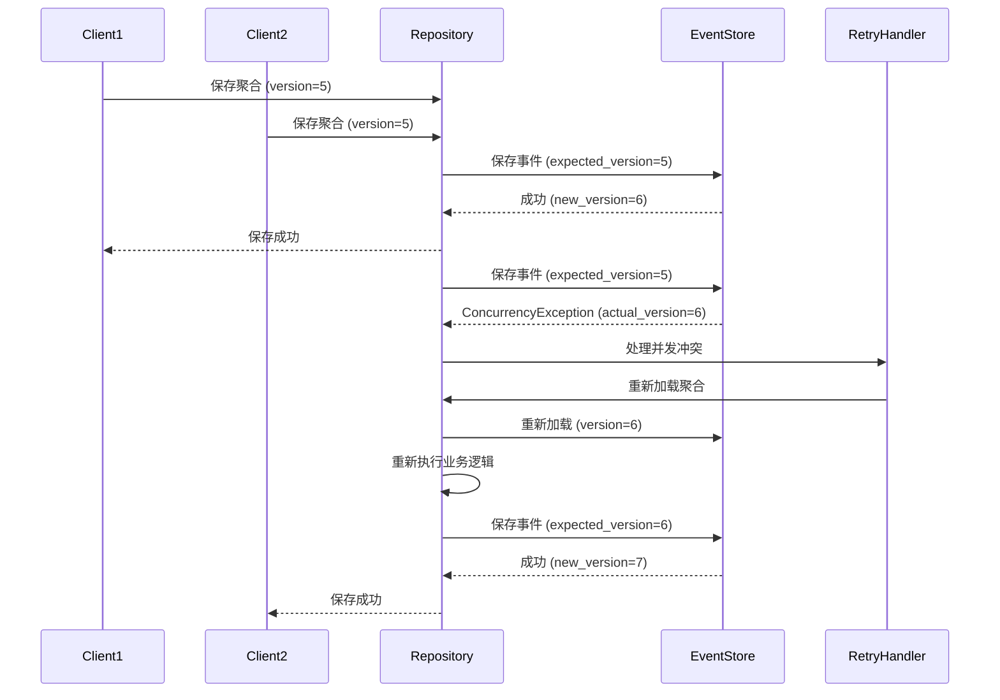
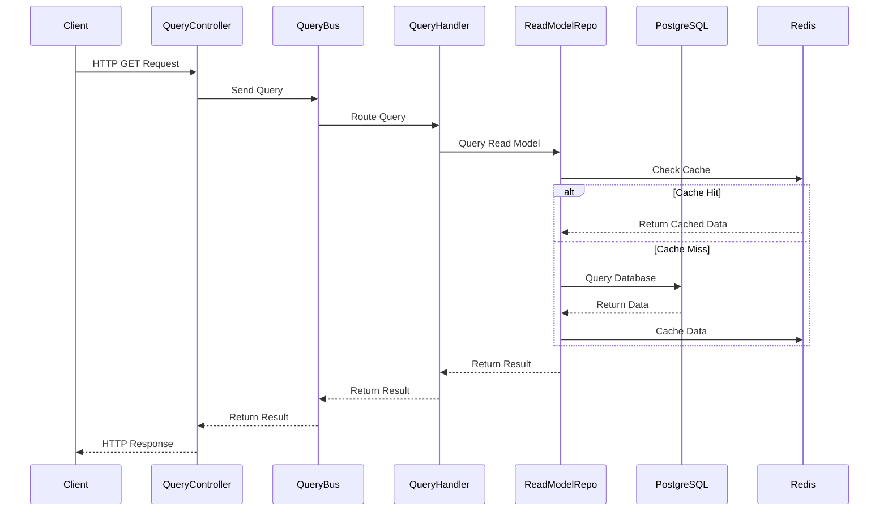
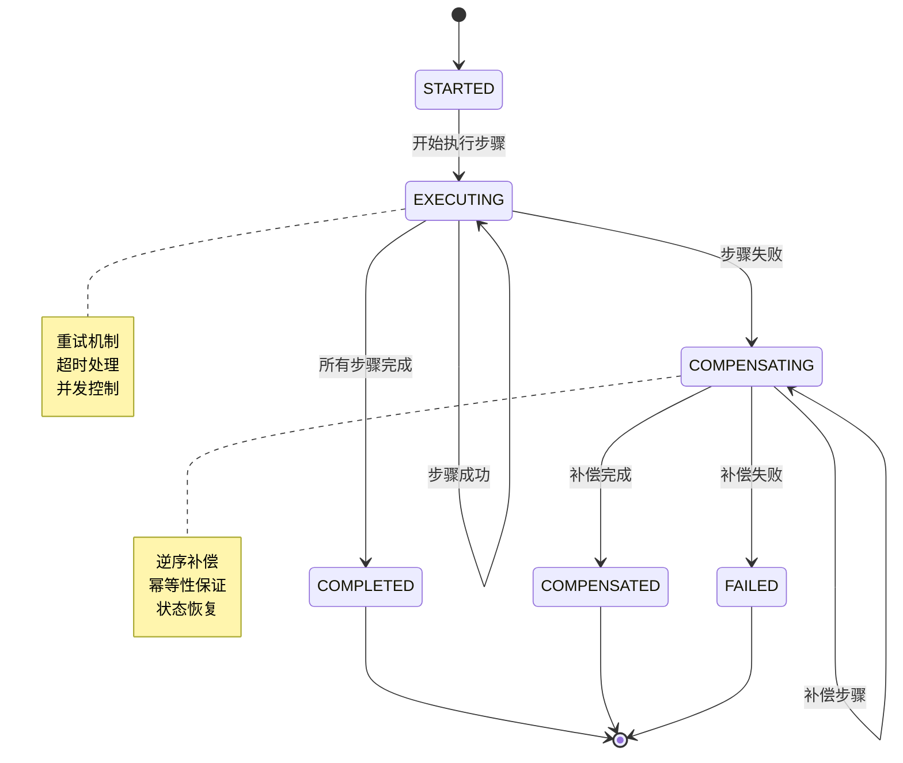
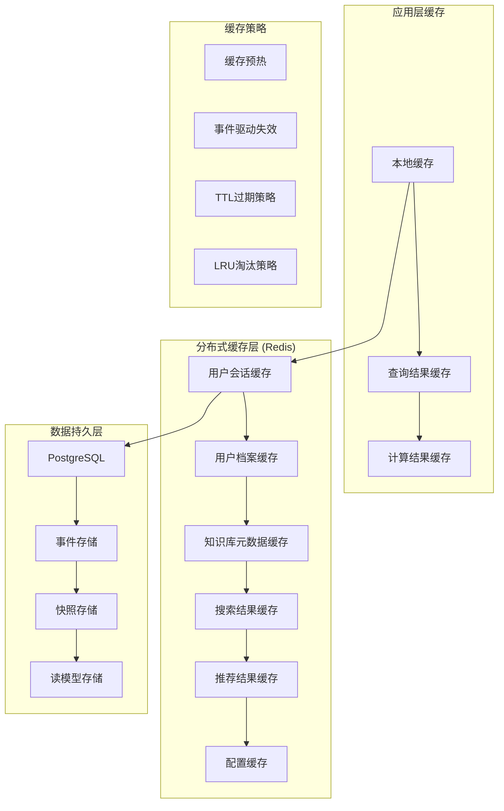
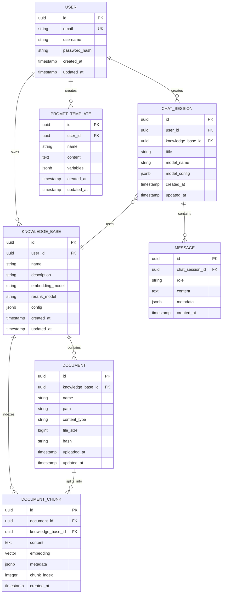

# 知识库管理系统技术架构文档

## 1. 架构设计



## 2. 技术描述

* **前端**: React\@18 + TypeScript\@5 + Next.js\@14 + Tailwind CSS\@3 + Vite

* **后端**: Spring Boot\@3 + Kotlin\@1.9 + Maven Wrapper + JDK\@24

* **数据库**: PostgreSQL\@15 (关系数据 + 向量数据)

* **缓存**: Redis\@7

* **消息队列**: Apache Kafka\@3.5

* **容器化**: Docker + Docker Compose

* **监控**: Prometheus + Grafana + OpenTelemetry

## 3. 路由定义

| 路由             | 用途                     |
| -------------- | ---------------------- |
| /              | 智能推荐首页，展示个性化推荐内容和学习统计  |
| /chat          | LLM对话页面，提供智能对话和RAG增强功能 |
| /knowledge     | 知识库管理页面，文件上传和知识库操作     |
| /history       | 对话历史页面，查看和管理历史对话记录     |
| /settings      | 系统配置页面，模型配置和用户设置       |
| /auth/login    | 用户登录页面                 |
| /auth/register | 用户注册页面                 |

## 4. API定义

### 4.1 用户服务API

**用户注册**

```
POST /api/users/register
```

请求参数:

| 参数名      | 参数类型   | 是否必需 | 描述     |
| -------- | ------ | ---- | ------ |
| email    | string | true | 用户邮箱地址 |
| password | string | true | 用户密码   |
| username | string | true | 用户名    |

响应参数:

| 参数名     | 参数类型    | 描述      |
| ------- | ------- | ------- |
| success | boolean | 注册是否成功  |
| userId  | string  | 用户ID    |
| token   | string  | JWT认证令牌 |

**用户登录**

```
POST /api/users/login
```

请求示例:

```json
{
  "email": "user@example.com",
  "password": "password123"
}
```

### 4.2 知识库服务API

**创建知识库**

```
POST /api/knowledge/create
```

请求参数:

| 参数名            | 参数类型   | 是否必需  | 描述      |
| -------------- | ------ | ----- | ------- |
| name           | string | true  | 知识库名称   |
| description    | string | false | 知识库描述   |
| embeddingModel | string | true  | 嵌入模型ID  |
| rerankModel    | string | true  | 重排序模型ID |

**文件上传**

```
POST /api/knowledge/{knowledgeId}/upload
```

**知识库搜索**

```
GET /api/knowledge/{knowledgeId}/search
```

### 4.3 对话服务API

**创建对话**

```
POST /api/chat/create
```

**发送消息**

```
POST /api/chat/{chatId}/message
```

**获取对话历史**

```
GET /api/chat/history
```

### 4.4 推荐服务API

**获取推荐内容**

```
GET /api/recommendations
```

**更新学习目标**

```
POST /api/recommendations/goals
```

## 5. 微服务架构设计

### 5.1 服务拆分策略

系统按功能领域进行横向拆分，采用DDD方法论和六边形架构，每个功能分为领域模块和应用模块：

#### 5.1.1 用户服务

* **lifee-user** (领域模块 - 内六边形): 用户聚合根、值对象、领域事件

* **lifee-user-app** (应用模块 - 外六边形): REST控制器、JPA实体、仓储实现

#### 5.1.2 知识库服务

* **lifee-knowledge** (领域模块 - 内六边形): 知识库聚合根、文档实体、向量化领域服务

* **lifee-knowledge-app** (应用模块 - 外六边形): 文件上传控制器、PostgreSQL向量存储适配器

#### 5.1.3 对话服务

* **lifee-chat** (领域模块 - 内六边形): 对话聚合根、消息实体、RAG领域服务

* **lifee-chat-app** (应用模块 - 外六边形): WebSocket控制器、LLM客户端适配器、MCP集成

#### 5.1.4 推荐服务

* **lifee-recommendation** (领域模块 - 内六边形): 推荐算法领域服务、学习目标值对象

* **lifee-recommendation-app** (应用模块 - 外六边形): 推荐API控制器、Redis缓存适配器

#### 5.1.5 配置服务

* **lifee-config** (领域模块 - 内六边形): 配置聚合根、模型配置值对象

* **lifee-config-app** (应用模块 - 外六边形): 配置管理控制器、配置存储适配器

#### 5.1.6 基础设施服务

* **lifee-gateway**: Spring Cloud Gateway API网关

* **lifee-common**: 共享领域事件、CQRS基础设施、Saga协调器

### 5.2 DDD六边形架构详细设计

#### 5.2.1 架构层次划分



#### 5.2.2 模块结构设计

**领域模块 (Domain Module) - 内六边形**

```
lifee-{service}/
├── src/main/kotlin/com/lifee/{service}/domain/
│   ├── aggregates/          # 聚合根
│   │   ├── {Service}AggregateRoot.kt
│   │   └── {Service}Factory.kt
│   ├── entities/            # 实体
│   │   └── {Entity}.kt
│   ├── valueobjects/        # 值对象
│   │   ├── {Service}Id.kt
│   │   └── {ValueObject}.kt
│   ├── events/              # 领域事件
│   │   ├── {Service}CreatedEvent.kt
│   │   └── {Service}UpdatedEvent.kt
│   ├── services/            # 领域服务
│   │   └── {Service}DomainService.kt
│   └── repositories/        # 仓储接口
│       └── {Service}Repository.kt
└── build.gradle.kts
```

**应用模块 (Application Module) - 外六边形**

```
lifee-{service}-app/
├── src/main/kotlin/com/lifee/{service}/
│   ├── adapters/
│   │   ├── web/             # Web适配器
│   │   │   ├── controllers/
│   │   │   ├── dto/
│   │   │   └── mappers/
│   │   ├── persistence/     # 持久化适配器
│   │   │   ├── entities/
│   │   │   ├── repositories/
│   │   │   └── mappers/
│   │   └── external/        # 外部服务适配器
│   │       ├── clients/
│   │       └── mappers/
│   ├── application/
│   │   ├── commands/        # 命令处理
│   │   │   ├── handlers/
│   │   │   └── {Command}.kt
│   │   ├── queries/         # 查询处理
│   │   │   ├── handlers/
│   │   │   └── {Query}.kt
│   │   ├── events/          # 事件处理
│   │   │   └── handlers/
│   │   └── services/        # 应用服务
│   ├── config/              # 配置
│   │   ├── DatabaseConfig.kt
│   │   ├── KafkaConfig.kt
│   │   └── SecurityConfig.kt
│   └── {Service}Application.kt
└── build.gradle.kts
```

### 5.3 CQRS和事件溯源实现

#### 5.3.1 事件溯源架构



**事件溯源技术栈:**

* Spring Boot 3.2+
* Kotlin 1.9+
* 自定义事件溯源框架 (EventSourcedAggregateRoot)
* PostgreSQL (事件存储 + 快照存储)
* Kafka (事件总线)
* Redis (缓存层)

#### 5.3.2 快照管理机制



#### 5.3.3 并发冲突处理



#### 5.3.2 查询端实现



#### 5.3.4 Saga事务协调



**Saga协调器核心功能:**

* **分布式事务管理**: 协调跨服务的长事务
* **补偿机制**: 自动执行补偿操作保证最终一致性
* **重试策略**: 指数退避重试和超时处理
* **状态持久化**: Saga状态持久化和恢复
* **监控告警**: Saga执行状态监控和异常告警

#### 5.3.5 缓存架构设计



**缓存优化策略:**

* **多层缓存**: 应用层 + 分布式缓存 + 数据库缓存
* **智能预热**: 系统启动预热 + 定时预热热点数据
* **事件驱动失效**: 基于领域事件的精确缓存失效
* **性能监控**: 缓存命中率、响应时间、内存使用率监控

### 5.4 技术实现细节

#### 5.4.1 Spring Boot配置

**主要依赖 (build.gradle.kts)**

```kotlin
dependencies {
    // Spring Boot
    implementation("org.springframework.boot:spring-boot-starter-web")
    implementation("org.springframework.boot:spring-boot-starter-data-jpa")
    implementation("org.springframework.boot:spring-boot-starter-data-redis")
    implementation("org.springframework.boot:spring-boot-starter-security")
    implementation("org.springframework.boot:spring-boot-starter-actuator")
    
    // Kotlin
    implementation("org.jetbrains.kotlin:kotlin-reflect")
    implementation("org.jetbrains.kotlin:kotlin-stdlib-jdk8")
    implementation("com.fasterxml.jackson.module:jackson-module-kotlin")
    
    // 自定义事件溯源框架
    implementation("com.lifee:lifee-common:1.0.0") // 事件溯源基础设施
    
    // 快照和缓存
    implementation("org.springframework.boot:spring-boot-starter-cache")
    implementation("com.github.ben-manes.caffeine:caffeine") // 本地缓存
    
    // Database
    implementation("org.postgresql:postgresql")
    implementation("com.github.pgvector:pgvector:0.1.4")
    implementation("org.springframework.boot:spring-boot-starter-data-redis")
    
    // Message Queue
    implementation("org.springframework.kafka:spring-kafka")
    
    // Monitoring
    implementation("io.micrometer:micrometer-registry-prometheus")
    implementation("io.opentelemetry:opentelemetry-api")
    implementation("io.opentelemetry.instrumentation:opentelemetry-spring-boot-starter")
    
    // Testing
    testImplementation("org.springframework.boot:spring-boot-starter-test")
    testImplementation("org.testcontainers:postgresql")
    testImplementation("org.testcontainers:kafka")
    testImplementation("io.kotest:kotest-runner-junit5")
    testImplementation("io.mockk:mockk")
}
```

#### 5.4.2 安全性设计

**JWT认证配置**

```kotlin
@Configuration
@EnableWebSecurity
class SecurityConfig {
    
    @Bean
    fun securityFilterChain(http: HttpSecurity): SecurityFilterChain {
        return http
            .csrf { it.disable() }
            .sessionManagement { it.sessionCreationPolicy(SessionCreationPolicy.STATELESS) }
            .authorizeHttpRequests {
                it.requestMatchers("/api/auth/**").permitAll()
                  .requestMatchers("/actuator/**").permitAll()
                  .anyRequest().authenticated()
            }
            .oauth2ResourceServer { it.jwt(Customizer.withDefaults()) }
            .build()
    }
}
```

**数据加密**

* 密码使用BCrypt加密

* 敏感数据使用AES-256加密

* 传输层使用TLS 1.3

* API密钥使用环境变量管理

#### 5.4.3 监控和可观测性

**Prometheus指标配置**

```kotlin
@Configuration
class MetricsConfig {
    
    @Bean
    fun meterRegistryCustomizer(): MeterRegistryCustomizer<MeterRegistry> {
        return MeterRegistryCustomizer { registry ->
            registry.config()
                .commonTags("application", "lifee-backend")
                .commonTags("environment", environment)
        }
    }
    
    @Bean
    fun timedAspect(registry: MeterRegistry): TimedAspect {
        return TimedAspect(registry)
    }
}
```

**OpenTelemetry分布式追踪**

```yaml
management:
  tracing:
    sampling:
      probability: 1.0
  otlp:
    tracing:
      endpoint: http://jaeger:14268/api/traces
```

## 6. 测试策略

### 6.1 测试金字塔

```mermaid
pyramid
    title 测试金字塔 (90%覆盖率目标)
    "E2E Tests (5%)" : 5
    "Integration Tests (25%)" : 25  
    "Unit Tests (70%)" : 70
```

### 6.2 单元测试 (Kotest + MockK)

**领域层测试示例**

```kotlin
class UserAggregateTest : FunSpec({
    
    test("should create user with valid email") {
        // Given
        val email = Email("test@example.com")
        val username = Username("testuser")
        val password = "securePassword123"
        
        // When
        val user = User.create(email, username, password)
        
        // Then
        user.email shouldBe email
        user.username shouldBe username
        user.isActive() shouldBe true
    }
    
    test("should throw exception for invalid email") {
        // Given & When & Then
        shouldThrow<InvalidEmailException> {
            Email("invalid-email")
        }
    }
})
```

### 6.3 集成测试 (TestContainers)

**仓储层测试**

```kotlin
@SpringBootTest
@Testcontainers
class UserRepositoryIntegrationTest {
    
    @Container
    companion object {
        @JvmStatic
        val postgres = PostgreSQLContainer("postgres:15")
            .withDatabaseName("lifee_test")
            .withUsername("test")
            .withPassword("test")
    }
    
    @Test
    fun `should save and find user by email`() {
        // Test implementation
    }
}
```

### 6.4 端到端测试 (Playwright)

**API测试**

```kotlin
class UserApiE2ETest {
    
    @Test
    fun `should register new user successfully`() {
        // Given
        val request = CreateUserRequest(
            email = "newuser@example.com",
            username = "newuser",
            password = "securePassword123"
        )
        
        // When
        val response = restTemplate.postForEntity(
            "/api/users/register",
            request,
            CreateUserResponse::class.java
        )
        
        // Then
        response.statusCode shouldBe HttpStatus.CREATED
        response.body?.success shouldBe true
    }
}
```

## 7. CI/CD流水线

### 7.1 GitLab CI配置

```yaml
stages:
  - test
  - build
  - security-scan
  - deploy

variables:
  MAVEN_OPTS: "-Dmaven.repo.local=.m2/repository"
  DOCKER_DRIVER: overlay2

test:
  stage: test
  image: openjdk:21-jdk
  script:
    - ./gradlew test jacocoTestReport
    - ./gradlew sonarqube
  coverage: '/Total.*?([0-9]{1,3})%/'
  artifacts:
    reports:
      junit: build/test-results/test/TEST-*.xml
      coverage_report:
        coverage_format: jacoco
        path: build/reports/jacoco/test/jacocoTestReport.xml

build:
  stage: build
  image: docker:latest
  services:
    - docker:dind
  script:
    - docker build -t $CI_REGISTRY_IMAGE:$CI_COMMIT_SHA .
    - docker push $CI_REGISTRY_IMAGE:$CI_COMMIT_SHA

security-scan:
  stage: security-scan
  image: owasp/zap2docker-stable
  script:
    - zap-baseline.py -t http://localhost:8080

deploy-staging:
  stage: deploy
  script:
    - kubectl apply -f k8s/staging/
  environment:
    name: staging
    url: https://staging.lifee.com
  only:
    - develop

deploy-production:
  stage: deploy
  script:
    - kubectl apply -f k8s/production/
  environment:
    name: production
    url: https://lifee.com
  only:
    - main
  when: manual
```

### 7.2 Kubernetes部署配置

**微服务部署清单**

```yaml
apiVersion: apps/v1
kind: Deployment
metadata:
  name: lifee-user-service
spec:
  replicas: 3
  selector:
    matchLabels:
      app: lifee-user-service
  template:
    metadata:
      labels:
        app: lifee-user-service
    spec:
      containers:
      - name: lifee-user-service
        image: lifee/user-service:latest
        ports:
        - containerPort: 8080
        env:
        - name: SPRING_PROFILES_ACTIVE
          value: "production"
        - name: DATABASE_URL
          valueFrom:
            secretKeyRef:
              name: database-secret
              key: url
        resources:
          requests:
            memory: "512Mi"
            cpu: "250m"
          limits:
            memory: "1Gi"
            cpu: "500m"
        livenessProbe:
          httpGet:
            path: /actuator/health
            port: 8080
          initialDelaySeconds: 30
          periodSeconds: 10
        readinessProbe:
          httpGet:
            path: /actuator/health/readiness
            port: 8080
          initialDelaySeconds: 5
          periodSeconds: 5
```

## 8. 数据模型

### 6.1 领域模型定义



### 6.2 数据定义语言

**用户表 (users)**

```sql
-- 创建用户表
CREATE TABLE users (
    id UUID PRIMARY KEY DEFAULT gen_random_uuid(),
    email VARCHAR(255) UNIQUE NOT NULL,
    username VARCHAR(100) NOT NULL,
    password_hash VARCHAR(255) NOT NULL,
    created_at TIMESTAMP WITH TIME ZONE DEFAULT NOW(),
    updated_at TIMESTAMP WITH TIME ZONE DEFAULT NOW()
);

-- 创建索引
CREATE INDEX idx_users_email ON users(email);
CREATE INDEX idx_users_created_at ON users(created_at DESC);
```

**知识库表 (knowledge\_bases)**

```sql
-- 创建知识库表
CREATE TABLE knowledge_bases (
    id UUID PRIMARY KEY DEFAULT gen_random_uuid(),
    user_id UUID NOT NULL REFERENCES users(id) ON DELETE CASCADE,
    name VARCHAR(255) NOT NULL,
    description TEXT,
    embedding_model VARCHAR(100) NOT NULL,
    rerank_model VARCHAR(100) NOT NULL,
    config JSONB DEFAULT '{}',
    created_at TIMESTAMP WITH TIME ZONE DEFAULT NOW(),
    updated_at TIMESTAMP WITH TIME ZONE DEFAULT NOW()
);

-- 创建索引
CREATE INDEX idx_knowledge_bases_user_id ON knowledge_bases(user_id);
CREATE INDEX idx_knowledge_bases_created_at ON knowledge_bases(created_at DESC);
```

**文档块表 (document\_chunks)**

```sql
-- 启用向量扩展
CREATE EXTENSION IF NOT EXISTS vector;

-- 创建文档块表
CREATE TABLE document_chunks (
    id UUID PRIMARY KEY DEFAULT gen_random_uuid(),
    document_id UUID NOT NULL REFERENCES documents(id) ON DELETE CASCADE,
    knowledge_base_id UUID NOT NULL REFERENCES knowledge_bases(id) ON DELETE CASCADE,
    content TEXT NOT NULL,
    embedding vector(1536),
    metadata JSONB DEFAULT '{}',
    chunk_index INTEGER NOT NULL,
    created_at TIMESTAMP WITH TIME ZONE DEFAULT NOW()
);

-- 创建向量索引
CREATE INDEX idx_document_chunks_embedding ON document_chunks 
USING ivfflat (embedding vector_cosine_ops) WITH (lists = 100);

-- 创建其他索引
CREATE INDEX idx_document_chunks_document_id ON document_chunks(document_id);
CREATE INDEX idx_document_chunks_knowledge_base_id ON document_chunks(knowledge_base_id);
```

**对话会话表 (chat\_sessions)**

```sql
-- 创建对话会话表
CREATE TABLE chat_sessions (
    id UUID PRIMARY KEY DEFAULT gen_random_uuid(),
    user_id UUID NOT NULL REFERENCES users(id) ON DELETE CASCADE,
    knowledge_base_id UUID REFERENCES knowledge_bases(id) ON DELETE SET NULL,
    title VARCHAR(255) NOT NULL,
    model_name VARCHAR(100) NOT NULL,
    model_config JSONB DEFAULT '{}',
    created_at TIMESTAMP WITH TIME ZONE DEFAULT NOW(),
    updated_at TIMESTAMP WITH TIME ZONE DEFAULT NOW()
);

-- 创建索引
CREATE INDEX idx_chat_sessions_user_id ON chat_sessions(user_id);
CREATE INDEX idx_chat_sessions_created_at ON chat_sessions(created_at DESC);
```

**初始化数据**

```sql
-- 插入默认模型配置
INSERT INTO model_configs (name, type, provider, config) VALUES
('gpt-4', 'chat', 'openai', '{"temperature": 0.7, "max_tokens": 2048}'),
('text-embedding-ada-002', 'embedding', 'openai', '{"dimensions": 1536}'),
('bge-reranker-large', 'rerank', 'huggingface', '{"top_k": 10}');
```

