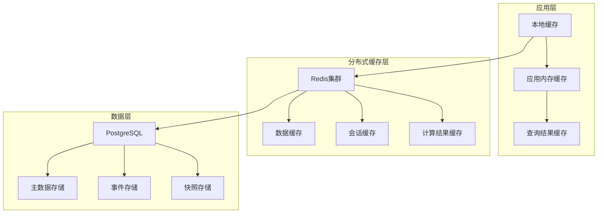

# 缓存优化策略文档

## 1. 缓存架构概述

本系统采用多层缓存架构，结合Redis分布式缓存和应用层缓存，实现高性能的数据访问和计算优化。

### 1.1 缓存层次结构



## 2. Redis缓存策略

### 2.1 缓存键命名规范

```kotlin
object CacheKeys {
    // 用户相关缓存
    const val USER_PREFIX = "user:"
    const val USER_PROFILE = "user:profile:{userId}"
    const val USER_SESSION = "user:session:{sessionId}"
    const val USER_PERMISSIONS = "user:permissions:{userId}"
    
    // 知识库相关缓存
    const val KB_PREFIX = "kb:"
    const val KB_METADATA = "kb:metadata:{kbId}"
    const val KB_DOCUMENTS = "kb:documents:{kbId}"
    const val KB_SEARCH_RESULTS = "kb:search:{kbId}:{queryHash}"
    
    // 对话相关缓存
    const val CHAT_PREFIX = "chat:"
    const val CHAT_HISTORY = "chat:history:{conversationId}"
    const val CHAT_CONTEXT = "chat:context:{conversationId}"
    
    // 推荐相关缓存
    const val RECOMMENDATION_PREFIX = "rec:"
    const val USER_RECOMMENDATIONS = "rec:user:{userId}"
    const val RECOMMENDATION_MODEL = "rec:model:{modelVersion}"
    
    // 配置相关缓存
    const val CONFIG_PREFIX = "config:"
    const val USER_CONFIG = "config:user:{userId}"
    const val SYSTEM_CONFIG = "config:system"
}
```

### 2.2 缓存过期策略

```kotlin
object CacheExpiration {
    // 用户数据缓存时间
    const val USER_PROFILE_TTL = 3600L // 1小时
    const val USER_SESSION_TTL = 86400L // 24小时
    const val USER_PERMISSIONS_TTL = 1800L // 30分钟
    
    // 知识库数据缓存时间
    const val KB_METADATA_TTL = 7200L // 2小时
    const val KB_SEARCH_RESULTS_TTL = 1800L // 30分钟
    const val KB_DOCUMENTS_TTL = 3600L // 1小时
    
    // 对话数据缓存时间
    const val CHAT_HISTORY_TTL = 3600L // 1小时
    const val CHAT_CONTEXT_TTL = 1800L // 30分钟
    
    // 推荐数据缓存时间
    const val USER_RECOMMENDATIONS_TTL = 7200L // 2小时
    const val RECOMMENDATION_MODEL_TTL = 86400L // 24小时
    
    // 配置数据缓存时间
    const val USER_CONFIG_TTL = 3600L // 1小时
    const val SYSTEM_CONFIG_TTL = 86400L // 24小时
}
```

## 3. 具体缓存优化点

### 3.1 用户服务缓存优化

#### 3.1.1 用户档案缓存

```kotlin
@Service
class UserProfileCacheService(
    private val redisTemplate: RedisTemplate<String, String>,
    private val userRepository: UserRepository
) {
    
    @Cacheable(value = ["userProfile"], key = "#userId")
    fun getUserProfile(userId: String): UserProfile? {
        return redisTemplate.opsForValue().get(CacheKeys.USER_PROFILE.replace("{userId}", userId))
            ?.let { JsonUtils.fromJson(it, UserProfile::class.java) }
            ?: userRepository.findById(userId)?.let { user ->
                val profile = UserProfile.from(user)
                cacheUserProfile(userId, profile)
                profile
            }
    }
    
    fun cacheUserProfile(userId: String, profile: UserProfile) {
        val key = CacheKeys.USER_PROFILE.replace("{userId}", userId)
        redisTemplate.opsForValue().set(
            key, 
            JsonUtils.toJson(profile), 
            Duration.ofSeconds(CacheExpiration.USER_PROFILE_TTL)
        )
    }
    
    @CacheEvict(value = ["userProfile"], key = "#userId")
    fun evictUserProfile(userId: String) {
        val key = CacheKeys.USER_PROFILE.replace("{userId}", userId)
        redisTemplate.delete(key)
    }
}
```

#### 3.1.2 用户权限缓存

```kotlin
@Service
class UserPermissionCacheService(
    private val redisTemplate: RedisTemplate<String, String>
) {
    
    fun getUserPermissions(userId: String): Set<String> {
        val key = CacheKeys.USER_PERMISSIONS.replace("{userId}", userId)
        return redisTemplate.opsForSet().members(key) ?: emptySet()
    }
    
    fun cacheUserPermissions(userId: String, permissions: Set<String>) {
        val key = CacheKeys.USER_PERMISSIONS.replace("{userId}", userId)
        redisTemplate.delete(key)
        if (permissions.isNotEmpty()) {
            redisTemplate.opsForSet().add(key, *permissions.toTypedArray())
            redisTemplate.expire(key, Duration.ofSeconds(CacheExpiration.USER_PERMISSIONS_TTL))
        }
    }
}
```

### 3.2 知识库服务缓存优化

#### 3.2.1 知识库元数据缓存

```kotlin
@Service
class KnowledgeBaseCacheService(
    private val redisTemplate: RedisTemplate<String, String>,
    private val knowledgeBaseRepository: KnowledgeBaseRepository
) {
    
    @Cacheable(value = ["kbMetadata"], key = "#kbId")
    fun getKnowledgeBaseMetadata(kbId: String): KnowledgeBaseMetadata? {
        val key = CacheKeys.KB_METADATA.replace("{kbId}", kbId)
        return redisTemplate.opsForValue().get(key)
            ?.let { JsonUtils.fromJson(it, KnowledgeBaseMetadata::class.java) }
            ?: knowledgeBaseRepository.findById(kbId)?.let { kb ->
                val metadata = KnowledgeBaseMetadata.from(kb)
                cacheKnowledgeBaseMetadata(kbId, metadata)
                metadata
            }
    }
    
    fun cacheKnowledgeBaseMetadata(kbId: String, metadata: KnowledgeBaseMetadata) {
        val key = CacheKeys.KB_METADATA.replace("{kbId}", kbId)
        redisTemplate.opsForValue().set(
            key,
            JsonUtils.toJson(metadata),
            Duration.ofSeconds(CacheExpiration.KB_METADATA_TTL)
        )
    }
}
```

#### 3.2.2 搜索结果缓存

```kotlin
@Service
class SearchResultCacheService(
    private val redisTemplate: RedisTemplate<String, String>
) {
    
    fun getSearchResults(kbId: String, query: String): List<SearchResult>? {
        val queryHash = query.hashCode().toString()
        val key = CacheKeys.KB_SEARCH_RESULTS
            .replace("{kbId}", kbId)
            .replace("{queryHash}", queryHash)
        
        return redisTemplate.opsForValue().get(key)
            ?.let { JsonUtils.fromJson(it, object : TypeReference<List<SearchResult>>() {}) }
    }
    
    fun cacheSearchResults(kbId: String, query: String, results: List<SearchResult>) {
        val queryHash = query.hashCode().toString()
        val key = CacheKeys.KB_SEARCH_RESULTS
            .replace("{kbId}", kbId)
            .replace("{queryHash}", queryHash)
        
        redisTemplate.opsForValue().set(
            key,
            JsonUtils.toJson(results),
            Duration.ofSeconds(CacheExpiration.KB_SEARCH_RESULTS_TTL)
        )
    }
    
    fun evictSearchResults(kbId: String) {
        val pattern = CacheKeys.KB_SEARCH_RESULTS
            .replace("{kbId}", kbId)
            .replace("{queryHash}", "*")
        
        redisTemplate.keys(pattern).forEach { key ->
            redisTemplate.delete(key)
        }
    }
}
```

### 3.3 对话服务缓存优化

#### 3.3.1 对话历史缓存

```kotlin
@Service
class ConversationCacheService(
    private val redisTemplate: RedisTemplate<String, String>
) {
    
    fun getChatHistory(conversationId: String): List<ChatMessage>? {
        val key = CacheKeys.CHAT_HISTORY.replace("{conversationId}", conversationId)
        return redisTemplate.opsForList().range(key, 0, -1)
            ?.mapNotNull { JsonUtils.fromJson(it, ChatMessage::class.java) }
    }
    
    fun addChatMessage(conversationId: String, message: ChatMessage) {
        val key = CacheKeys.CHAT_HISTORY.replace("{conversationId}", conversationId)
        redisTemplate.opsForList().rightPush(key, JsonUtils.toJson(message))
        redisTemplate.expire(key, Duration.ofSeconds(CacheExpiration.CHAT_HISTORY_TTL))
        
        // 限制历史消息数量
        val maxMessages = 100
        val currentSize = redisTemplate.opsForList().size(key) ?: 0
        if (currentSize > maxMessages) {
            redisTemplate.opsForList().trim(key, currentSize - maxMessages, -1)
        }
    }
    
    fun getChatContext(conversationId: String): ChatContext? {
        val key = CacheKeys.CHAT_CONTEXT.replace("{conversationId}", conversationId)
        return redisTemplate.opsForValue().get(key)
            ?.let { JsonUtils.fromJson(it, ChatContext::class.java) }
    }
    
    fun updateChatContext(conversationId: String, context: ChatContext) {
        val key = CacheKeys.CHAT_CONTEXT.replace("{conversationId}", conversationId)
        redisTemplate.opsForValue().set(
            key,
            JsonUtils.toJson(context),
            Duration.ofSeconds(CacheExpiration.CHAT_CONTEXT_TTL)
        )
    }
}
```

### 3.4 推荐服务缓存优化

#### 3.4.1 用户推荐缓存

```kotlin
@Service
class RecommendationCacheService(
    private val redisTemplate: RedisTemplate<String, String>
) {
    
    fun getUserRecommendations(userId: String): List<Recommendation>? {
        val key = CacheKeys.USER_RECOMMENDATIONS.replace("{userId}", userId)
        return redisTemplate.opsForValue().get(key)
            ?.let { JsonUtils.fromJson(it, object : TypeReference<List<Recommendation>>() {}) }
    }
    
    fun cacheUserRecommendations(userId: String, recommendations: List<Recommendation>) {
        val key = CacheKeys.USER_RECOMMENDATIONS.replace("{userId}", userId)
        redisTemplate.opsForValue().set(
            key,
            JsonUtils.toJson(recommendations),
            Duration.ofSeconds(CacheExpiration.USER_RECOMMENDATIONS_TTL)
        )
    }
    
    fun getRecommendationModel(modelVersion: String): RecommendationModel? {
        val key = CacheKeys.RECOMMENDATION_MODEL.replace("{modelVersion}", modelVersion)
        return redisTemplate.opsForValue().get(key)
            ?.let { JsonUtils.fromJson(it, RecommendationModel::class.java) }
    }
    
    fun cacheRecommendationModel(modelVersion: String, model: RecommendationModel) {
        val key = CacheKeys.RECOMMENDATION_MODEL.replace("{modelVersion}", modelVersion)
        redisTemplate.opsForValue().set(
            key,
            JsonUtils.toJson(model),
            Duration.ofSeconds(CacheExpiration.RECOMMENDATION_MODEL_TTL)
        )
    }
}
```

#### 3.4.2 推荐算法结果缓存

```kotlin
@Service
class RecommendationAlgorithmCacheService(
    private val redisTemplate: RedisTemplate<String, String>
) {
    
    fun getComputedFeatures(userId: String): UserFeatures? {
        val key = "rec:features:$userId"
        return redisTemplate.opsForValue().get(key)
            ?.let { JsonUtils.fromJson(it, UserFeatures::class.java) }
    }
    
    fun cacheComputedFeatures(userId: String, features: UserFeatures) {
        val key = "rec:features:$userId"
        redisTemplate.opsForValue().set(
            key,
            JsonUtils.toJson(features),
            Duration.ofSeconds(7200) // 2小时
        )
    }
    
    fun getSimilarUsers(userId: String): List<String>? {
        val key = "rec:similar:$userId"
        return redisTemplate.opsForList().range(key, 0, -1)
    }
    
    fun cacheSimilarUsers(userId: String, similarUsers: List<String>) {
        val key = "rec:similar:$userId"
        redisTemplate.delete(key)
        if (similarUsers.isNotEmpty()) {
            redisTemplate.opsForList().rightPushAll(key, similarUsers)
            redisTemplate.expire(key, Duration.ofSeconds(14400)) // 4小时
        }
    }
}
```

### 3.5 配置服务缓存优化

#### 3.5.1 用户配置缓存

```kotlin
@Service
class ConfigurationCacheService(
    private val redisTemplate: RedisTemplate<String, String>
) {
    
    fun getUserConfig(userId: String): Map<String, Any>? {
        val key = CacheKeys.USER_CONFIG.replace("{userId}", userId)
        return redisTemplate.opsForHash<String, Any>().entries(key)
            .takeIf { it.isNotEmpty() }
    }
    
    fun cacheUserConfig(userId: String, config: Map<String, Any>) {
        val key = CacheKeys.USER_CONFIG.replace("{userId}", userId)
        redisTemplate.delete(key)
        if (config.isNotEmpty()) {
            redisTemplate.opsForHash<String, Any>().putAll(key, config)
            redisTemplate.expire(key, Duration.ofSeconds(CacheExpiration.USER_CONFIG_TTL))
        }
    }
    
    fun updateUserConfigItem(userId: String, configKey: String, value: Any) {
        val key = CacheKeys.USER_CONFIG.replace("{userId}", userId)
        redisTemplate.opsForHash<String, Any>().put(key, configKey, value)
        redisTemplate.expire(key, Duration.ofSeconds(CacheExpiration.USER_CONFIG_TTL))
    }
    
    fun getSystemConfig(): Map<String, Any>? {
        val key = CacheKeys.SYSTEM_CONFIG
        return redisTemplate.opsForHash<String, Any>().entries(key)
            .takeIf { it.isNotEmpty() }
    }
    
    fun cacheSystemConfig(config: Map<String, Any>) {
        val key = CacheKeys.SYSTEM_CONFIG
        redisTemplate.delete(key)
        if (config.isNotEmpty()) {
            redisTemplate.opsForHash<String, Any>().putAll(key, config)
            redisTemplate.expire(key, Duration.ofSeconds(CacheExpiration.SYSTEM_CONFIG_TTL))
        }
    }
}
```

## 4. 缓存预热策略

### 4.1 系统启动预热

```kotlin
@Component
class CacheWarmupService(
    private val userProfileCacheService: UserProfileCacheService,
    private val configurationCacheService: ConfigurationCacheService,
    private val recommendationCacheService: RecommendationCacheService
) {
    
    @EventListener(ApplicationReadyEvent::class)
    fun warmupCache() {
        logger.info("开始缓存预热...")
        
        // 预热系统配置
        warmupSystemConfig()
        
        // 预热活跃用户数据
        warmupActiveUsers()
        
        // 预热推荐模型
        warmupRecommendationModels()
        
        logger.info("缓存预热完成")
    }
    
    private fun warmupSystemConfig() {
        try {
            // 加载系统配置到缓存
            val systemConfig = loadSystemConfigFromDatabase()
            configurationCacheService.cacheSystemConfig(systemConfig)
            logger.info("系统配置预热完成")
        } catch (e: Exception) {
            logger.error("系统配置预热失败", e)
        }
    }
    
    private fun warmupActiveUsers() {
        try {
            // 获取最近活跃的用户列表
            val activeUsers = getActiveUsersFromDatabase()
            activeUsers.forEach { userId ->
                try {
                    val userProfile = loadUserProfileFromDatabase(userId)
                    userProfileCacheService.cacheUserProfile(userId, userProfile)
                } catch (e: Exception) {
                    logger.warn("用户 $userId 档案预热失败", e)
                }
            }
            logger.info("活跃用户数据预热完成，共预热 ${activeUsers.size} 个用户")
        } catch (e: Exception) {
            logger.error("活跃用户数据预热失败", e)
        }
    }
    
    private fun warmupRecommendationModels() {
        try {
            // 加载最新的推荐模型
            val latestModel = loadLatestRecommendationModel()
            recommendationCacheService.cacheRecommendationModel(latestModel.version, latestModel)
            logger.info("推荐模型预热完成")
        } catch (e: Exception) {
            logger.error("推荐模型预热失败", e)
        }
    }
}
```

### 4.2 定时预热任务

```kotlin
@Component
class ScheduledCacheWarmupService {
    
    @Scheduled(fixedRate = 3600000) // 每小时执行一次
    fun hourlyWarmup() {
        // 预热热门搜索结果
        warmupPopularSearchResults()
        
        // 预热活跃对话上下文
        warmupActiveConversations()
    }
    
    @Scheduled(cron = "0 0 2 * * ?") // 每天凌晨2点执行
    fun dailyWarmup() {
        // 预热用户推荐
        warmupUserRecommendations()
        
        // 清理过期缓存
        cleanupExpiredCache()
    }
    
    private fun warmupPopularSearchResults() {
        // 实现热门搜索结果预热逻辑
    }
    
    private fun warmupActiveConversations() {
        // 实现活跃对话预热逻辑
    }
    
    private fun warmupUserRecommendations() {
        // 实现用户推荐预热逻辑
    }
    
    private fun cleanupExpiredCache() {
        // 实现过期缓存清理逻辑
    }
}
```

## 5. 缓存失效策略

### 5.1 事件驱动的缓存失效

```kotlin
@Component
class CacheInvalidationEventHandler(
    private val userProfileCacheService: UserProfileCacheService,
    private val knowledgeBaseCacheService: KnowledgeBaseCacheService,
    private val searchResultCacheService: SearchResultCacheService,
    private val recommendationCacheService: RecommendationCacheService
) {
    
    @EventListener
    fun handleUserProfileUpdated(event: UserProfileUpdatedEvent) {
        userProfileCacheService.evictUserProfile(event.userId)
        logger.info("用户 ${event.userId} 档案缓存已失效")
    }
    
    @EventListener
    fun handleKnowledgeBaseUpdated(event: KnowledgeBaseUpdatedEvent) {
        knowledgeBaseCacheService.evictKnowledgeBaseMetadata(event.kbId)
        searchResultCacheService.evictSearchResults(event.kbId)
        logger.info("知识库 ${event.kbId} 相关缓存已失效")
    }
    
    @EventListener
    fun handleDocumentAdded(event: DocumentAddedEvent) {
        searchResultCacheService.evictSearchResults(event.kbId)
        logger.info("知识库 ${event.kbId} 搜索结果缓存已失效")
    }
    
    @EventListener
    fun handleUserBehaviorCollected(event: UserBehaviorCollectedEvent) {
        recommendationCacheService.evictUserRecommendations(event.userId)
        logger.info("用户 ${event.userId} 推荐缓存已失效")
    }
}
```

### 5.2 批量缓存失效

```kotlin
@Service
class BatchCacheInvalidationService(
    private val redisTemplate: RedisTemplate<String, String>
) {
    
    fun invalidateUserRelatedCache(userId: String) {
        val patterns = listOf(
            "user:*:$userId",
            "rec:*:$userId",
            "config:user:$userId",
            "chat:*:$userId"
        )
        
        patterns.forEach { pattern ->
            val keys = redisTemplate.keys(pattern)
            if (keys.isNotEmpty()) {
                redisTemplate.delete(keys)
                logger.info("批量删除用户 $userId 相关缓存，共 ${keys.size} 个键")
            }
        }
    }
    
    fun invalidateKnowledgeBaseRelatedCache(kbId: String) {
        val patterns = listOf(
            "kb:*:$kbId",
            "chat:*:$kbId"
        )
        
        patterns.forEach { pattern ->
            val keys = redisTemplate.keys(pattern)
            if (keys.isNotEmpty()) {
                redisTemplate.delete(keys)
                logger.info("批量删除知识库 $kbId 相关缓存，共 ${keys.size} 个键")
            }
        }
    }
}
```

## 6. 缓存监控和指标

### 6.1 缓存性能指标

```kotlin
@Component
class CacheMetricsCollector(
    private val meterRegistry: MeterRegistry,
    private val redisTemplate: RedisTemplate<String, String>
) {
    
    private val cacheHitCounter = Counter.builder("cache.hit")
        .description("缓存命中次数")
        .register(meterRegistry)
    
    private val cacheMissCounter = Counter.builder("cache.miss")
        .description("缓存未命中次数")
        .register(meterRegistry)
    
    private val cacheEvictionCounter = Counter.builder("cache.eviction")
        .description("缓存失效次数")
        .register(meterRegistry)
    
    fun recordCacheHit(cacheType: String) {
        cacheHitCounter.increment(Tags.of("type", cacheType))
    }
    
    fun recordCacheMiss(cacheType: String) {
        cacheMissCounter.increment(Tags.of("type", cacheType))
    }
    
    fun recordCacheEviction(cacheType: String) {
        cacheEvictionCounter.increment(Tags.of("type", cacheType))
    }
    
    @Scheduled(fixedRate = 60000) // 每分钟收集一次
    fun collectRedisMetrics() {
        try {
            val info = redisTemplate.execute { connection ->
                connection.info("memory")
            } as Properties
            
            val usedMemory = info.getProperty("used_memory")?.toLongOrNull() ?: 0L
            val maxMemory = info.getProperty("maxmemory")?.toLongOrNull() ?: 0L
            
            Gauge.builder("redis.memory.used")
                .description("Redis已使用内存")
                .register(meterRegistry) { usedMemory.toDouble() }
            
            if (maxMemory > 0) {
                Gauge.builder("redis.memory.usage.ratio")
                    .description("Redis内存使用率")
                    .register(meterRegistry) { usedMemory.toDouble() / maxMemory }
            }
        } catch (e: Exception) {
            logger.error("收集Redis指标失败", e)
        }
    }
}
```

### 6.2 缓存健康检查

```kotlin
@Component
class CacheHealthIndicator(
    private val redisTemplate: RedisTemplate<String, String>
) : HealthIndicator {
    
    override fun health(): Health {
        return try {
            val pong = redisTemplate.execute { connection ->
                connection.ping()
            }
            
            if ("PONG" == pong) {
                Health.up()
                    .withDetail("redis", "可用")
                    .withDetail("response", pong)
                    .build()
            } else {
                Health.down()
                    .withDetail("redis", "响应异常")
                    .withDetail("response", pong)
                    .build()
            }
        } catch (e: Exception) {
            Health.down()
                .withDetail("redis", "连接失败")
                .withException(e)
                .build()
        }
    }
}
```

## 7. 缓存最佳实践

### 7.1 缓存设计原则

- **缓存穿透防护**: 对于不存在的数据，缓存空值或使用布隆过滤器
- **缓存雪崩防护**: 设置随机的过期时间，避免大量缓存同时失效
- **缓存击穿防护**: 对于热点数据，使用分布式锁防止并发重建
- **数据一致性**: 使用事件驱动的缓存失效策略保证数据一致性

### 7.2 性能优化建议

- **合理设置TTL**: 根据数据更新频率和业务需求设置合适的过期时间
- **批量操作**: 使用Pipeline或事务减少网络往返次数
- **数据压缩**: 对于大对象，考虑使用压缩算法减少内存占用
- **连接池优化**: 合理配置Redis连接池参数

### 7.3 监控和告警

- **缓存命中率**: 监控各类缓存的命中率，低于阈值时告警
- **内存使用率**: 监控Redis内存使用情况，防止内存溢出
- **响应时间**: 监控缓存操作的响应时间，及时发现性能问题
- **错误率**: 监控缓存操作的错误率，及时发现连接或配置问题
