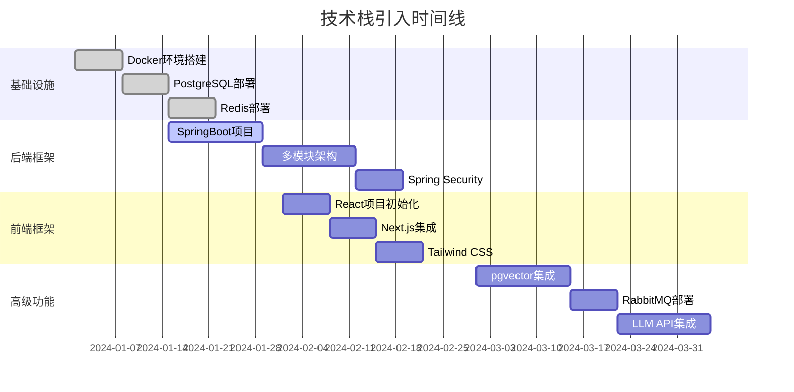

# LifeE智能知识库系统开发计划

## 1. 项目概述

### 1.1 项目基本信息
- **项目名称：** LifeE智能知识库Web应用
- **项目周期：** 22-30周（约5.5-7.5个月）
- **团队规模：** 6-8人
- **开发模式：** 敏捷开发，2周一个Sprint
- **技术架构：** 多模块单体架构，基于DDD设计

### 1.2 项目目标
- **核心目标：** 构建集LLM对话、知识库管理、智能推荐于一体的个人知识管理系统
- **技术目标：** 建立可扩展、高性能、易维护的技术架构
- **业务目标：** 提供优秀的用户体验，满足个人知识管理需求

## 2. 团队组织架构

### 2.1 核心团队角色

| 角色 | 人数 | 主要职责 |
|------|------|----------|
| 项目经理 | 1 | 项目管理、进度控制、风险管控 |
| 技术负责人 | 1 | 技术架构、技术决策、代码审查 |
| 后端开发工程师 | 3 | 后端服务开发、API设计、数据库设计 |
| 前端开发工程师 | 2 | 前端界面开发、用户体验优化 |
| DevOps工程师 | 1 | 基础设施、CI/CD、部署运维 |
| 测试工程师 | 1 | 测试用例设计、自动化测试、质量保证 |

### 2.2 领域责任分工

| 领域 | 负责人 | 主要模块 |
|------|--------|----------|
| 用户域 | 后端工程师A | 用户管理、认证授权、权限控制 |
| 知识库域 | 后端工程师B | 文档管理、搜索检索、向量化处理 |
| 对话域 | 后端工程师C | LLM集成、对话管理、RAG实现 |
| 推荐域 | 后端工程师B | 智能推荐、行为分析、学习轨迹 |
| 配置域 | 后端工程师A | 系统配置、模型管理、MCP集成 |
| 前端界面 | 前端工程师A+B | 用户界面、交互设计、状态管理 |

## 3. 技术实施路线图

### 3.1 技术栈引入顺序



### 3.2 关键技术决策时间点

| 时间节点 | 技术决策 | 决策内容 |
|----------|----------|----------|
| 第2周 | 数据库架构 | 确定PostgreSQL + pgvector方案 |
| 第4周 | 后端架构 | 确定多模块DDD架构设计 |
| 第6周 | 前端架构 | 确定React + Next.js + TypeScript方案 |
| 第10周 | 搜索策略 | 确定PostgreSQL FTS + pgvector混合搜索 |
| 第14周 | LLM集成 | 确定多模型支持和MCP协议集成 |
| 第18周 | 消息队列 | 评估是否需要从RabbitMQ升级到Kafka |

## 4. 详细开发计划

### 4.1 阶段一：基础架构搭建（6周，3个Sprint）

#### Sprint 1（第1-2周）：项目初始化
**目标：** 完成项目脚手架和基础环境搭建

**主要任务：**
- [ ] 项目仓库创建和分支策略制定
- [ ] Maven多模块项目结构搭建
- [ ] Docker开发环境配置
- [ ] PostgreSQL数据库部署和初始化
- [ ] Redis缓存服务部署
- [ ] CI/CD流水线基础配置

**交付物：**
- 可运行的项目框架
- 完整的开发环境
- 基础的CI/CD流水线

**验收标准：**
- 项目可以正常启动
- 数据库连接正常
- 基础的健康检查接口可用

#### Sprint 2（第3-4周）：用户认证模块
**目标：** 实现用户注册、登录和基础权限管理

**主要任务：**
- [ ] 用户域数据库表设计和创建
- [ ] Spring Security配置
- [ ] JWT认证机制实现
- [ ] 用户注册、登录API开发
- [ ] 基础权限控制实现
- [ ] 前端登录页面开发

**交付物：**
- 完整的用户认证系统
- 用户注册登录界面
- 基础的权限控制机制

**验收标准：**
- 用户可以正常注册和登录
- JWT令牌机制工作正常
- 基础的API权限控制生效

#### Sprint 3（第5-6周）：基础API框架
**目标：** 建立标准化的API框架和前后端通信机制

**主要任务：**
- [ ] RESTful API标准制定
- [ ] 统一异常处理机制
- [ ] API文档自动生成（Swagger）
- [ ] 前端HTTP客户端封装
- [ ] 状态管理框架搭建（Zustand）
- [ ] 基础UI组件库搭建

**交付物：**
- 标准化的API框架
- 完整的前后端通信机制
- 基础的UI组件库

**验收标准：**
- API文档自动生成和更新
- 前后端数据交互正常
- 统一的错误处理机制生效

### 4.2 阶段二：对话功能开发（6周，3个Sprint）

#### Sprint 4（第7-8周）：LLM对话集成
**目标：** 实现基础的LLM对话功能

**主要任务：**
- [ ] LLM API客户端开发
- [ ] 对话管理系统实现
- [ ] 流式输出支持
- [ ] 对话历史存储
- [ ] 对话界面开发
- [ ] 多模型支持框架

**交付物：**
- LLM对话功能
- 对话管理系统
- 对话界面

**验收标准：**
- 支持多轮对话
- 流式输出正常显示
- 对话历史正确保存

#### Sprint 5（第9-10周）：对话归档和提示词管理
**目标：** 实现对话内容归档和提示词管理功能

**主要任务：**
- [ ] 对话归档机制实现
- [ ] Markdown格式导出
- [ ] 提示词模板管理
- [ ] 提示词分类和标签
- [ ] 对话分享功能
- [ ] 归档内容搜索

**交付物：**
- 对话归档功能
- 提示词管理系统
- 对话分享机制

**验收标准：**
- 对话可正确归档到知识库
- 提示词模板可复用
- 支持对话内容分享

#### Sprint 6（第11-12周）：系统配置和模型管理
**目标：** 实现完整的系统配置和模型管理功能

**主要任务：**
- [ ] 模型配置管理界面
- [ ] 多模型实例支持
- [ ] 模型健康检查
- [ ] 系统参数配置
- [ ] 配置导入导出
- [ ] MCP协议集成

**交付物：**
- 模型管理系统
- 系统配置界面
- MCP协议支持

**验收标准：**
- 支持多种AI模型配置
- 模型切换正常工作
- 配置可导入导出

### 4.3 阶段三：知识库功能开发（8周，4个Sprint）

#### Sprint 7（第13-14周）：知识库基础功能
**目标：** 实现知识库创建和基础文件管理

**主要任务：**
- [ ] 知识库域数据库设计
- [ ] 知识库创建、编辑、删除API
- [ ] 文件上传接口开发
- [ ] 文件存储策略实现（本地/云存储）
- [ ] 知识库管理界面开发
- [ ] 文件上传组件开发

**交付物：**
- 知识库管理功能
- 文件上传功能
- 知识库管理界面

**验收标准：**
- 用户可以创建和管理知识库
- 支持单文件和批量文件上传
- 文件存储和检索正常

#### Sprint 8（第15-16周）：文档处理和索引
**目标：** 实现文档解析、分段和向量化处理

**主要任务：**
- [ ] 多格式文档解析器开发
- [ ] 文档智能分段算法实现
- [ ] pgvector扩展集成
- [ ] 文档向量化处理流程
- [ ] 文档索引构建机制
- [ ] 文档处理状态监控

**交付物：**
- 多格式文档解析功能
- 文档向量化处理系统
- 文档索引构建机制

**验收标准：**
- 支持PDF、Word、Markdown等格式解析
- 文档向量化处理成功率>95%
- 索引构建时间合理（<1分钟/MB）

#### Sprint 9（第17-18周）：搜索功能实现
**目标：** 实现混合搜索功能（全文+向量）

**主要任务：**
- [ ] PostgreSQL全文搜索配置
- [ ] 向量相似度搜索实现
- [ ] 混合搜索算法开发
- [ ] 搜索结果排序和重排序
- [ ] 搜索API开发
- [ ] 搜索界面和结果展示

**交付物：**
- 完整的搜索功能
- 搜索结果界面
- 搜索性能优化

**验收标准：**
- 搜索响应时间<1秒
- 搜索结果相关性良好
- 支持搜索结果高亮显示

#### Sprint 10（第19-20周）：RAG增强对话
**目标：** 实现基于知识库的RAG增强对话

**主要任务：**
- [ ] 知识检索与对话集成
- [ ] RAG提示词模板设计
- [ ] 检索结果与对话上下文融合
- [ ] 对话知识来源标注
- [ ] RAG效果评估机制
- [ ] 对话配置界面

**交付物：**
- RAG增强对话功能
- 知识来源追溯
- 对话效果评估

**验收标准：**
- RAG对话准确性明显提升
- 知识来源可追溯
- 支持选择特定知识库对话

### 4.4 阶段四：智能推荐功能开发（4周，2个Sprint）

#### Sprint 11（第21-22周）：智能推荐系统
**目标：** 实现基础的智能推荐功能

**主要任务：**
- [ ] 用户行为数据收集
- [ ] 推荐算法实现（协同过滤、内容推荐）
- [ ] 记忆曲线推荐算法
- [ ] 推荐结果生成和排序
- [ ] 推荐界面开发
- [ ] 推荐效果反馈机制

**交付物：**
- 智能推荐系统
- 推荐界面
- 推荐效果评估

**验收标准：**
- 推荐内容相关性良好
- 推荐点击率>15%
- 支持用户反馈优化

#### Sprint 12（第23-24周）：性能优化和高级搜索
**目标：** 系统性能优化和高级搜索功能实现

**主要任务：**
- [ ] 数据库查询优化
- [ ] 缓存策略优化
- [ ] 搜索性能调优
- [ ] 高级搜索功能（时间范围、标签等）
- [ ] 搜索建议和自动补全
- [ ] 性能监控指标

**交付物：**
- 性能优化方案
- 高级搜索功能
- 性能监控体系

**验收标准：**
- API响应时间<500ms
- 搜索响应时间<1秒
- 系统并发能力>100用户

### 4.5 阶段五：优化与扩展（6周，3个Sprint）

#### Sprint 13（第25-26周）：用户体验优化
**目标：** 全面优化用户体验和界面交互

**主要任务：**
- [ ] 界面响应式设计优化
- [ ] 交互体验改进
- [ ] 错误提示和用户引导
- [ ] 快捷键支持
- [ ] 主题和个性化设置
- [ ] 移动端适配（PWA）

**交付物：**
- 优化的用户界面
- 响应式设计
- PWA支持

**验收标准：**
- 界面在不同设备上正常显示
- 用户操作流畅自然
- 支持基础的PWA功能

#### Sprint 14（第27-28周）：安全加固和监控
**目标：** 完善系统安全和监控体系

**主要任务：**
- [ ] 安全漏洞扫描和修复
- [ ] 数据加密和脱敏
- [ ] 审计日志完善
- [ ] 系统监控和告警
- [ ] 性能指标收集
- [ ] 日志分析和可视化

**交付物：**
- 安全加固方案
- 监控告警系统
- 日志分析平台

**验收标准：**
- 通过安全扫描测试
- 监控指标完整准确
- 告警机制正常工作

#### Sprint 15（第29-30周）：部署自动化和文档完善
**目标：** 完善部署流程和项目文档

**主要任务：**
- [ ] 生产环境部署脚本
- [ ] 自动化部署流水线
- [ ] 备份和恢复方案
- [ ] 运维文档编写
- [ ] 用户使用手册
- [ ] API文档完善

**交付物：**
- 自动化部署方案
- 完整的项目文档
- 运维手册

**验收标准：**
- 支持一键部署
- 文档完整准确
- 备份恢复流程可用

## 5. 质量保证体系

### 5.1 测试策略

#### 5.1.1 测试类型和覆盖率要求

| 测试类型 | 覆盖率要求 | 执行频率 | 负责人 |
|----------|------------|----------|--------|
| 单元测试 | >80% | 每次提交 | 开发工程师 |
| 集成测试 | >70% | 每日构建 | 测试工程师 |
| 接口测试 | 100% | 每次发布 | 测试工程师 |
| 端到端测试 | 核心流程100% | 每次发布 | 测试工程师 |
| 性能测试 | 关键接口100% | 每个Sprint | 测试工程师 |
| 安全测试 | 全覆盖 | 每个阶段 | DevOps工程师 |

#### 5.1.2 关键功能测试重点

**AI模型集成测试：**
- 多模型切换功能测试
- API调用稳定性测试
- 错误处理和重试机制测试
- 响应时间和并发性能测试

**向量搜索测试：**
- 大规模数据搜索性能测试
- 搜索准确性和相关性测试
- 混合搜索算法效果测试
- 索引构建和更新测试

**文件处理测试：**
- 多格式文件解析测试
- 大文件处理性能测试
- 并发上传和处理测试
- 文件损坏和异常处理测试

### 5.2 代码质量标准

#### 5.2.1 代码规范
- **Kotlin代码规范：** 遵循Kotlin官方编码规范
- **TypeScript代码规范：** 遵循Airbnb JavaScript/TypeScript规范
- **代码审查：** 所有代码必须经过同行审查
- **静态代码分析：** 使用SonarQube进行代码质量检查

#### 5.2.2 性能标准
- **API响应时间：** 95%的请求响应时间<500ms
- **页面加载时间：** 首屏加载时间<2秒
- **搜索性能：** 千万级文档搜索响应时间<1秒
- **并发能力：** 支持100+并发用户

### 5.3 CI/CD流水线

```yaml
# CI/CD流水线阶段
stages:
  - 代码检查
    - 代码格式检查
    - 静态代码分析
    - 安全漏洞扫描
  
  - 构建测试
    - 单元测试执行
    - 代码覆盖率检查
    - 构建产物生成
  
  - 集成测试
    - 接口测试执行
    - 集成测试执行
    - 性能测试执行
  
  - 部署发布
    - 测试环境部署
    - 端到端测试
    - 生产环境部署
```

## 6. 风险管控策略

### 6.1 技术风险识别和缓解

#### 6.1.1 AI模型集成风险
**风险描述：** AI模型API不稳定，影响对话功能
**影响等级：** 高
**缓解措施：**
- 实现多模型备份机制
- 建立API调用重试和熔断机制
- 设计降级方案（本地模型或缓存响应）
- 建立模型性能监控和告警

#### 6.1.2 向量搜索性能风险
**风险描述：** 大规模数据下搜索性能不达标
**影响等级：** 中
**缓解措施：**
- 提前进行性能压测
- 优化向量索引策略
- 实现搜索结果缓存
- 设计分布式搜索架构预案

#### 6.1.3 数据处理风险
**风险描述：** 大文件处理导致内存溢出或处理超时
**影响等级：** 中
**缓解措施：**
- 实现流式文件处理
- 设置文件大小限制
- 建立异步处理队列
- 实现处理进度监控

### 6.2 项目风险管控

#### 6.2.1 进度风险
**风险描述：** 开发进度延期，影响项目交付
**影响等级：** 高
**缓解措施：**
- 建立每日站会和周报机制
- 实施敏捷开发和迭代交付
- 预留10-15%的缓冲时间
- 建立关键路径监控

#### 6.2.2 资源风险
**风险描述：** 人员流失或技能不足
**影响等级：** 中
**缓解措施：**
- 建立知识分享和文档机制
- 实施结对编程和交叉培训
- 预备后备人员计划
- 建立外部技术支持渠道

#### 6.2.3 质量风险
**风险描述：** 产品质量不达标，用户体验差
**影响等级：** 高
**缓解措施：**
- 建立完善的测试体系
- 实施持续集成和自动化测试
- 建立用户反馈收集机制
- 实施灰度发布和快速回滚

### 6.3 风险监控机制

| 风险类型 | 监控指标 | 监控频率 | 告警阈值 | 负责人 |
|----------|----------|----------|----------|--------|
| 技术风险 | API成功率、响应时间 | 实时 | 成功率<95% | DevOps工程师 |
| 进度风险 | Sprint完成率、燃尽图 | 每日 | 完成率<80% | 项目经理 |
| 质量风险 | 缺陷密度、测试覆盖率 | 每周 | 覆盖率<80% | 测试工程师 |
| 性能风险 | 响应时间、并发数 | 实时 | 响应时间>1s | 技术负责人 |

## 7. 里程碑和交付计划

### 7.1 主要里程碑

| 里程碑 | 时间节点 | 主要交付物 | 验收标准 |
|--------|----------|------------|----------|
| M1: 基础架构完成 | 第6周 | 项目框架、用户认证、基础API | 用户可注册登录，API正常工作 |
| M2: 对话功能完成 | 第12周 | LLM对话、提示词管理、配置管理 | 用户可进行AI对话和模型配置 |
| M3: 知识库功能完成 | 第20周 | 知识库管理、文档处理、搜索、RAG | 用户可上传文档并进行知识问答 |
| M4: 推荐功能完成 | 第24周 | 智能推荐、性能优化 | 系统功能完整，性能达标 |
| M5: 生产就绪 | 第30周 | 部署自动化、监控告警、文档完善 | 系统可投入生产使用 |

### 7.2 演示计划

#### 7.2.1 内部演示
- **频率：** 每个Sprint结束后
- **参与者：** 项目团队、产品负责人
- **内容：** Sprint成果展示、问题讨论、下Sprint规划

#### 7.2.2 里程碑演示
- **频率：** 每个里程碑完成后
- **参与者：** 项目团队、管理层、潜在用户
- **内容：** 阶段性成果展示、用户反馈收集、下阶段规划

### 7.3 发布计划

| 版本 | 发布时间 | 主要功能 | 发布范围 |
|------|----------|----------|----------|
| v0.1 Alpha | 第6周 | 基础框架、用户认证 | 内部测试 |
| v0.2 Beta | 第12周 | AI对话、配置管理 | 小范围用户测试 |
| v0.3 RC | 第20周 | 知识库管理、RAG功能 | 扩大用户测试 |
| v0.4 RC | 第24周 | 智能推荐、完整功能 | 预发布测试 |
| v1.0 Release | 第30周 | 生产就绪版本 | 正式发布 |

## 8. 资源需求和成本预算

### 8.1 人力资源需求

| 角色 | 月薪预算 | 项目周期 | 总成本 |
|------|----------|----------|--------|
| 项目经理 | 25K | 7.5个月 | 187.5K |
| 技术负责人 | 35K | 7.5个月 | 262.5K |
| 后端工程师（3人） | 25K×3 | 7.5个月 | 562.5K |
| 前端工程师（2人） | 22K×2 | 7.5个月 | 330K |
| DevOps工程师 | 28K | 7.5个月 | 210K |
| 测试工程师 | 20K | 7.5个月 | 150K |
| **人力成本总计** | | | **1,702.5K** |

### 8.2 基础设施成本

| 资源类型 | 月成本 | 项目周期 | 总成本 |
|----------|--------|----------|--------|
| 云服务器（开发/测试） | 5K | 7.5个月 | 37.5K |
| 数据库服务 | 3K | 7.5个月 | 22.5K |
| 存储服务 | 2K | 7.5个月 | 15K |
| AI模型API调用 | 8K | 7.5个月 | 60K |
| 其他工具和服务 | 2K | 7.5个月 | 15K |
| **基础设施成本总计** | | | **150K** |

### 8.3 总成本预算

| 成本类型 | 金额 | 占比 |
|----------|------|------|
| 人力成本 | 1,702.5K | 91.9% |
| 基础设施成本 | 150K | 8.1% |
| **项目总成本** | **1,852.5K** | **100%** |

### 8.4 成本控制措施

1. **人力成本控制：**
   - 合理安排人员投入时间
   - 避免不必要的加班成本
   - 提高开发效率减少返工

2. **基础设施成本控制：**
   - 合理选择云服务规格
   - 优化AI模型调用频率
   - 实施资源监控和自动扩缩容

3. **风险成本预留：**
   - 预留10%的成本缓冲
   - 建立成本超支预警机制

## 9. 项目监控和报告

### 9.1 项目监控指标

#### 9.1.1 进度监控
- **Sprint燃尽图：** 每日更新，监控Sprint进度
- **里程碑完成率：** 每周统计，监控整体进度
- **关键路径分析：** 识别影响项目进度的关键任务

#### 9.1.2 质量监控
- **代码质量指标：** 代码覆盖率、复杂度、重复率
- **缺陷统计：** 缺陷发现率、修复率、逃逸率
- **性能指标：** 响应时间、吞吐量、资源使用率

#### 9.1.3 成本监控
- **人力成本跟踪：** 实际工时vs计划工时
- **基础设施成本：** 云服务费用、API调用费用
- **成本偏差分析：** 实际成本vs预算成本

### 9.2 报告机制

#### 9.2.1 日报
- **内容：** 当日完成任务、遇到问题、明日计划
- **参与者：** 项目团队成员
- **形式：** 站会 + 书面报告

#### 9.2.2 周报
- **内容：** 周进度总结、质量指标、风险识别
- **参与者：** 项目团队、管理层
- **形式：** 书面报告 + 周会

#### 9.2.3 月报
- **内容：** 月度进度、成本分析、里程碑状态
- **参与者：** 项目团队、管理层、相关方
- **形式：** 正式报告 + 汇报会议

## 10. 项目成功标准

### 10.1 技术成功标准
- **功能完整性：** 所有PRD定义的核心功能100%实现
- **性能达标：** 系统性能指标达到PRD要求
- **质量标准：** 代码质量、测试覆盖率达到既定标准
- **安全合规：** 通过安全测试，满足数据保护要求

### 10.2 项目管理成功标准
- **时间控制：** 项目按时交付，延期不超过10%
- **成本控制：** 项目成本控制在预算范围内
- **质量控制：** 生产环境缺陷率<1%
- **团队满意度：** 团队成员满意度>80%

### 10.3 业务成功标准
- **用户体验：** 用户满意度>85%
- **功能使用率：** 核心功能使用率>70%
- **系统稳定性：** 系统可用性>99.5%
- **扩展能力：** 系统具备良好的扩展性和维护性

## 11. 总结

本开发计划基于LifeE智能知识库系统的PRD文档，制定了详细的30周开发计划，涵盖了从基础架构搭建到生产就绪的完整开发周期。

**开发顺序优化：**
本计划按照用户体验优先的原则，调整了开发顺序：
1. **基础架构 + 用户认证**（第1-6周）：建立项目基础
2. **对话功能 + 配置管理**（第7-12周）：优先实现核心AI对话体验
3. **知识库功能 + RAG集成**（第13-20周）：构建知识管理和增强对话
4. **智能推荐 + 性能优化**（第21-24周）：完善高级功能
5. **系统优化 + 生产就绪**（第25-30周）：确保生产可用性

**关键成功因素：**
1. **技术架构合理：** 采用DDD和六边形架构，确保系统可维护性
2. **团队组织有效：** 明确的角色分工和领域责任划分
3. **质量保证完善：** 建立完整的测试体系和CI/CD流水线
4. **风险管控到位：** 识别关键风险并制定相应缓解措施
5. **项目监控有效：** 建立完善的监控和报告机制

**项目预期收益：**
- 构建一个技术先进、功能完整的智能知识库系统
- 建立可扩展、高性能的技术架构
- 培养一支具备AI应用开发能力的技术团队
- 为后续产品迭代和商业化奠定坚实基础

通过严格执行本开发计划，LifeE项目将能够按时、按质、按预算完成交付，成为个人知识管理领域的优秀产品。